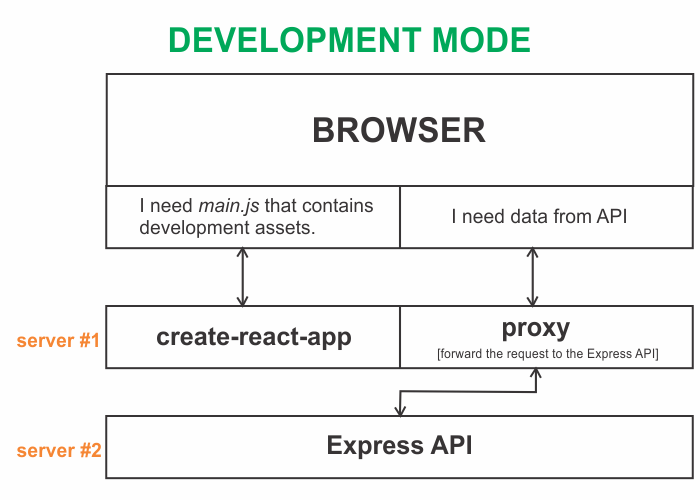
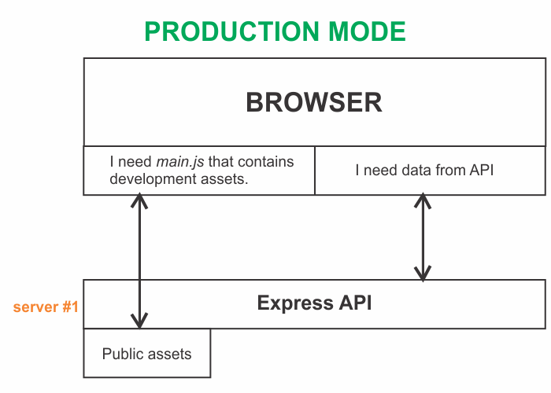
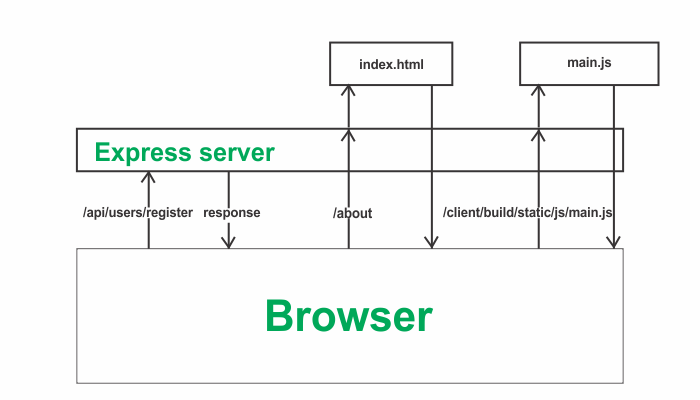

The following is how a typical full-stack application made using React & Express works in development mode:



We have two servers: one server made available by _create-react-app_ and another server created by Express. However, in production, the _create-react-app_ server does not exist anymore. It is the Express server, which is in charge of handling all the production assets.

> Remember, before we deploy our app to production, we run the command ~~npm run build~~ inside our ~~client~~ directory. This results in an optimized production build of our React project inside a folder called ~~build~~ that contains all the production assets.



Remember that a full-stack application made using React and Express contains both client-side routes handled by the React Router and server-side routes handled by the Express server.

The challenge is to write some logic that instructs the Express server how it should respond to a request asking for a client-side route. Before we write the logic, we will understand the concept of routing in production using the following diagram:



In the diagram above, when the client makes a request to the route ~~/api/users/register~~, the Express server responds back with some data. This is because we have already configured the ~~/api/users/register~~ API using Express.

What happens when the client makes a request to the route ~~/about~~?

We have not defined any route handler, which is responsible for the ~~/about~~ route in our Express server. The ~~/about~~ route is a client-side route configured inside the React Router.

In such a scenario, we will have to instruct Express that if it receives a request for a route that is not defined inside the Express server, then it will make the assumption that the client is making the request to a client-side route configured by the React Router.

Then the Express server sends back the ~~index.html~~ file. Inside ~~index.html~~, there is a \<script> tag to load the JavaScript bundle hosted by the Express server. So, the client makes another request to the server asking for the JavaScript bundle. After the server sends back the JavaScript bundle, React Router decides to display the ~~About~~ component.

The following code snippet is the ~~index.js~~ file (inside the _server_ directory) of a full-stack application deployed to production.

```js:title=server/index.js {numberLines, 2-2, 24-31}
const express = require("express");
const path = require("path");
const dotenv = require("dotenv");
const colors = require("colors");
const connectDB = require("./config/db");
const {
  notFound,
  globalErrorHandler,
} = require("./middleware/errorMiddleware");
const userRoutes = require("./routes/userRoutes");
const downloadRoutes = require("./routes/downloadRoutes");

dotenv.config();

connectDB();

const app = express();

app.use(express.json());

app.use("/api/users", userRoutes);
app.use("/api/download", downloadRoutes);

// Routing logic in production
if (process.env.NODE_ENV === "production") {
  app.use(express.static(path.join(__dirname, "../client/build")));

  app.get("*", (req, res) => {
    res.sendFile(path.resolve(__dirname, "../client", "build", "index.html"));
  });
}

app.use(notFound);
app.use(globalErrorHandler);

const PORT = process.env.PORT || 5000;

app.listen(PORT, () => {
  console.log(`Server listening on port ${PORT}`.yellow.bold);
});
```

```sh:title=sundaray.io/.env {numberLines, 1-1}
NODE_ENV=production
PORT=5000
MONGO_URI = value
JWT_SECRET = value
```

**LINE 28-30: The code essentially says that if we have nothing inside the ~~userRoutes~~ file and nothing inside the ~~downloadRoutes~~ file and there is no file inside the ~~client/build~~ directory that matches up with what the incoming request is looking for, we have exhausted all possibilities and therefore we will simply return back the ~~index.html~~ file.**
