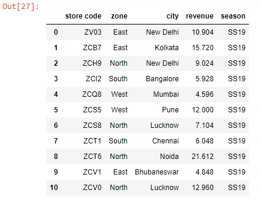
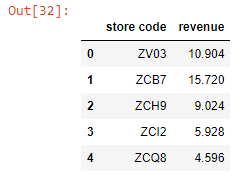

###### Learn more about selecting and adding columns to Pandas Dataframes in my blog post [here](https://hemanta.io/selecting-and-adding-columns-to-a-dataframe-in-pandas/).

Let’s first read an Excel worksheet into a Pandas Dataframe:

```py {numberLines}
import pandas as pd

data = pd.read_excel("budget.xlsx")

data.columns = data.columns.str.lower().str.strip()

data
```

**Output:**



We can select both rows and columns using chaining as shown below:

```py {numberLines}
data[1:5][['store code', 'revenue']]
```

**Output:**



First, we selected the ~~store code~~ & ~~revenue~~ columns for all rows and then we pulled out rows with indices 0, 1, 2, 3 & 4.

Note that column and row selection order does not matter.

```py {numberLines}
data[['store code', 'revenue']][:5]
```

**Output:**


