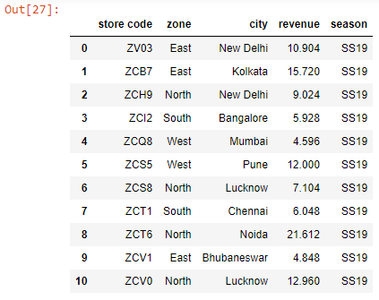
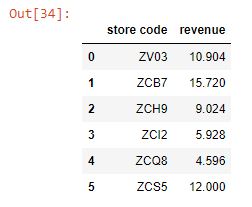
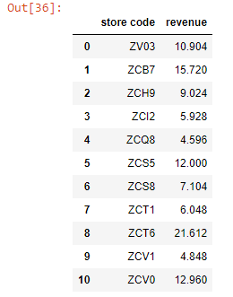
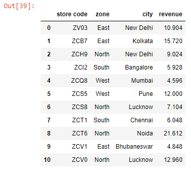
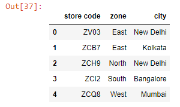
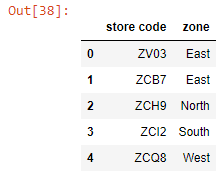

```toc

```

We can select both rows and columns in Pandas DataFrames using indexing operations.

For all indexing methods, we first provide the row indexer and then the column indexer with a comma separating them.

Let’s read an Excel worksheet into a Pandas Dataframe:

```py {numberLines}
import pandas as pd

data = pd.read_excel("budget.xlsx")

data.columns = data.columns.str.lower().str.strip()

data
```

**Output:**



### loc[ ]

We use ~~loc[]~~ to subset a Dataframe using label-based lookups.

**Syntax**

```sh
df.loc[row_indexer, column_indexer]
```

```py {numberLines}
data.loc[0:5, ['store code', 'revenue']]
```

**Output:**



We can select all rows if we use colon (~~:~~) as the row indexer.

```py {numberLines}
data.loc[:, ['store code', 'revenue']]
```

**Output:**



When using ~~loc[]~~, we can slice column names as well.

```py {numberLines}
data.loc[:, 'store code':'revenue']
```

**Output**



### iloc[ ]

We use ~~iloc[]~~ to subset a Dataframe using integer-based lookups.

**Note that the integer slicing that ~~iloc[]~~ employs is exclusive of the end index.**

```py {numberLines}
data.iloc[:5, [0, 1, 2]]
```

**Output:**



When using ~~iloc[]~~, we can use the slicing syntax for the columns as well.

```py {numberLines}
data.iloc[:5, 0:2]
```

**Output:**



###### Learn about row and column selection in Pandas using chaining in my blog post [here](http://localhost:8000/row-and-column-selection-in-pandas-using-chaining/).
