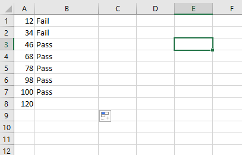

We can replace multiple ~~ElseIf~~ clauses with a ~~Select Case~~ statement, which executes one of several groups of statements, depending on the value of an expression.

**Syntax**

```vb {numberLines}
Select Case testexpression ' testexpression is required
    Case expressionlist-n
	statements-n ' Executed if testexpression matches any part of expressionlist-n
    Case Else
	elsestatement ' Executed if testexpression does not match any of the Case clause.
End Select
```

**Example: 1**

```vb {numberLines}
Function WhatZone(StoreCode As String) As String

Select Case StoreCode
    Case "ST01", "ST02", "ST03"
        WhatZone = "North"

    Case "ST04", "ST05", "ST06"
        WhatZone = "South"

    Case Else
        WhatZone = "Zone Not Found"
End Select

End Function
```


**Example:2**

```vb {numberLines}
Function PassFail(mark As Long) As String

Select Case mark
    Case 1 To 34
        PassFail = "Fail"

    Case 35 To 100
        PassFail = "Pass"

End Select

End Function
```

The ~~To~~ keyword specifies a range of values. If you use the ~~To~~ keyword, the smaller value must appear before ~~To~~.



**Example:3**

```vb {numberLines}
Function BonusCalc(revenue As Double) As Double

Select Case revenue
    Case Is < 500
        BonusCalc = revenue * 0.002

    Case Is < 1000
        BonusCalc = revenue * 0.005
End Select

End Function
```

We have to use the ~~Is~~ keyword with comparison operators to specify a range of values.


