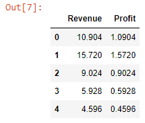

Let's read an Excel worksheet into a pandas dataframe:

```py {numberLines}
import pandas as pd

data = pd.read_excel("budget.xlsx")

data
```

**Output:**


We can select only the columns that contain numeric values (~~Revenue~~ & ~~Profit~~) using the ~~select_dtypes()~~ method and passing the string ~~number~~ to the ~~include~~ parameter.

```py {numberLines}
data.select_dtypes(include="number").head()
```

**Output:**


