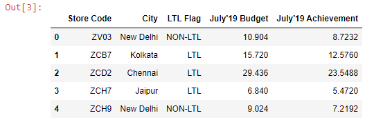

```toc

```

### Selecting a single column

Below, we have read the ~~budget.xlsx~~ file into a DataFrame.

```py {numberLines}
import pandas as pd

budget = pd.read_excel(“budget.xlsx”)
budget.head()
```

**Output:**



We can select a single column from the ~~budget~~ DataFrame using the bracket syntax:

```py {numberLines}
budget["Store Code"]
```

Output:


The selected column will be extracted as a Series object.

```py {numberLines}
type(budget["Store Code"])

pandas.core.series.Series
```

### Selecting two or more columns

We can select two or more columns from a DataFrame by passing a Python List inside the square brackets, where the List items are the column names that we want to select.

We can select the ~~Store Code~~ & ~~City~~ columns as shown below:

```py {numberLines}
budget[["Store Code", "City"]].head()
```

**Output:**


Because we have selected more than one column, the output is a DataFrame.

### Changing the order of the columns

If we want the resulting DataFrame to contain the selected columns in a specific order (_which is different from the original order_), all we need to do is to make sure that the column names that we pass to the Python List are in that specific order.

```py {numberLines}
budget[["City", "Store Code"]].head()
```

**Output:**


If the two pairs of square brackets are a bit confusing, we can assign the List to a variable and pass that variable inside the square brackets instead.

```py {numberLines}
columns = ["City", "Store Code"]

budget[columns].head()
```

### Adding Columns to a DataFrame

Let’s say we want to add a column named ~~Month~~ to the ~~budget~~ DataFrame. And the column should be populated with the value ~~August~~.

We can do so using the bracket syntax as shown below:

```py {numberLines}
budget["Month"] = "August"
```

Now, if we preview the ~~budget~~ DataFrame, we can see that we have the ~~Month~~ column added to the DataFrame.

```py {numberLines}
budget.head()
```

**Output:**


#### insert()

We can also add columns to a DataFrame using the ~~insert()~~ method.

- The first argument we pass to the ~~insert()~~ method is the position where we want to insert the new column.
- The second argument is the name of the new column that we want to add to the DataFrame.
- And the third argument is the value that we want the new column to be populated with.

```py {numberLines}
budget.insert(3, column = "Month", value="August")
```

> The ~~insert()~~ method permanently modifies the original DataFrame.

Let’s preview the ~~budget~~ DataFrame.

```py {numberLines}
budget.head()
```

**Output:**


We can see that the ~~Month~~ column has been added at the index position ~~0~~ and the entire column has been populated with the value ~~August~~.
