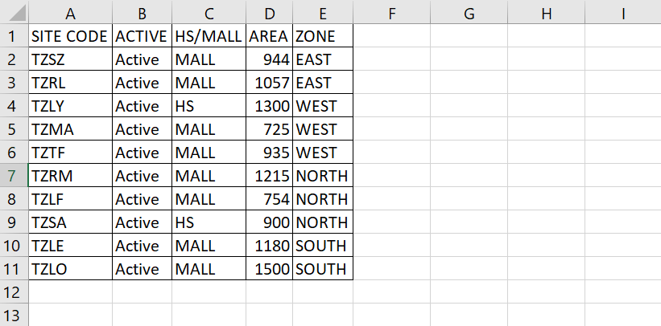
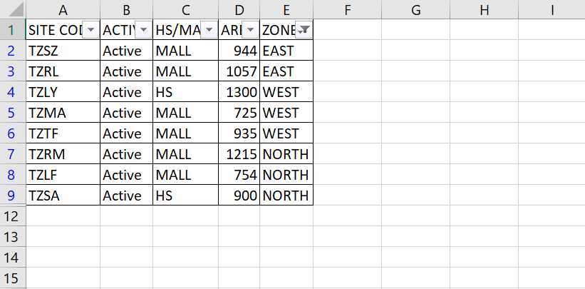

We can choose three or more items by changing the operator to ~~Operator:xlFilterValues~~ and specifying the list of items as an array in the ~~Criteria1~~.

The example below filters a list starting in cell E1 to display only the entries in which the values of field 5 is equal to the values: ~~East~~, ~~West~~ & ~~North~~.

```vb {numberLines}
Sub Filter_Demo()

Dim columnNumber As Long

columnNumber = ActiveCell.column

ActiveCell.AutoFilter _
    Field:=columnNumber, _
    Criteria1:=Array("East", "West", "North"), _
    Operator:=xlFilterValues

End Sub
```



Running the macro gives us the following result:


