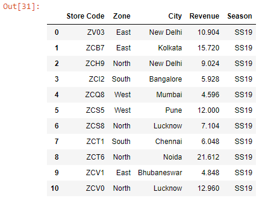
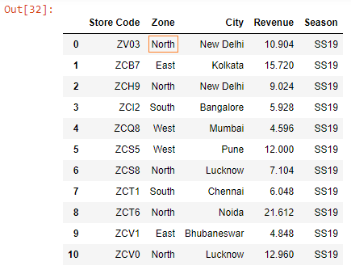
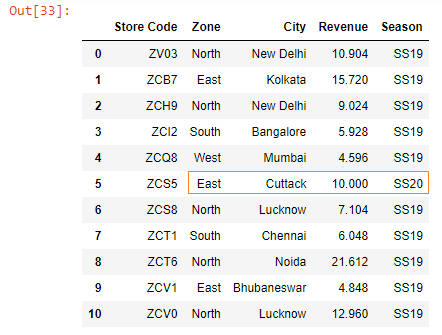

Let’s import an Excel workbook into a Dataframe:

```py {numberLines}
import pandas as pd

data = pd.read_excel('budget.xlsx')

data
```

**Output:**



There is a mistake in the Dataframe. The zone for the store ~~ZV03~~, located in New Delhi, should be ~~North~~, not ~~East~~. Let’s fix this:

_Note that the value we want to change sits at the intersection of row with index position 0 and column labelled ~~Zone~~._

```py {numberLines}
data.loc[0, 'Zone'] = 'North'

data
```

**Output:**



We can also set new values for a range of cells, as shown below:

```py {numberLines}
data.loc[5, ['Zone', 'City', 'Revenue', 'Season']] = ['East', 'Cuttack', 10, 'SS20']

data
```

**Output:**


