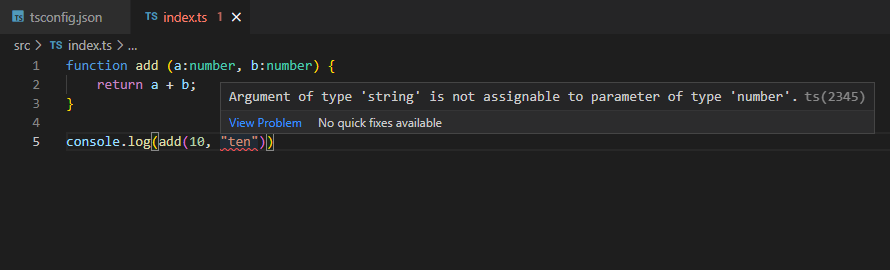
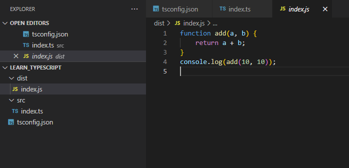

```toc

```

###### Learn how the TypeScript compiler works in my blog post [here](https://hemanta.io/how-does-the-typescript-compiler-work/).

First, make sure that the TypeScript compiler (tsc) is globally installed in your system. If not, then install _tsc_ globally (with the ~~-g~~ option) by running the following command in your terminal window:

```sh {numberLines}
npm install -g typescript
```

Check your tsc version using the following command:

```sh {numberLines}
tsc -v
```

Next, create a folder called ~~learn_typescript~~ on your desktop and open it in Visual Studio Code.

### tsconfig.json

Every TypeScript project should include a file called ~~tsconfig.json~~ in the root directory. This ~~tsconfig.json~~ is where we preconfigure the process of compilation. We define things like which files should be compiled, which directory to compile them to, which version of JavaScript to emit etc.

Create a ~~tsconfig.json~~ file in the root directory and include the following code sample:

```json {numberLines}
{
  "compilerOptions": {
    "baseUrl": "src",
    "outDir": "./dist",
    "noEmitOnError": true,
    "lib": ["dom", "es2015"],
    "target": "ES2015",
    "watch": true
  }
}
```

Let’s briefly go over some of these options and understand what they mean.

- ~~baseUrl~~: The folder _tsc_ looks into to find the TypeScript files.
- ~~outDir~~: The folder in which _tsc_ should put the generated ~~.js~~ files.
- ~~noEmitOnError~~: If any of the files have compilation errors, don’t generate JavaScript files.
- ~~lib~~: Which APIs should _tsc_ assume exist in the environment we will be running our code in.
- ~~target~~: The JavaScript version _tsc_ should compile our code to.
- ~~watch~~: The compiler will watch our TypeScript files and when they change, TypeScript will recompoile them.

The compiler would read all the options from ~~tsconfig.json~~.

### src folder

Next,create a ~~src~~ folder, and inside, create a file named ~~index.ts~~.

Include the following code snippet in ~~index.ts~~:

```ts {numberLines}
function add(a: number, b: number) {
  return a + b
}
```

We have a simple function named ~~add()~~ that takes in two parameters and returns their sum. Note that we have annotated the types of both the parameters. This means that while calling the ~~add()~~ function, we can only pass arguments that are of _number_ type.

Let's pass in one of the parameters as a string.

```ts {numberLines}
console.log(add(10, "ten"))
```



TypeScript shows a squiggly red line under ~~ten~~. When we hover the mouse over the red line, we will see a prompt explaining the error.

This error is caught even before we compile our code with the TypeScript compiler. It’s great that the error is caught before runtime.

Let’s rectify the error:

```ts {numberLines}
function add(a: number, b: number) {
  return a + b
}

console.log(add(10, 10))
```

### dist folder

Next, in the root directory, create a folder called ~~dist~~. (Remember that in the ~~tsconfig.json~~ file, we have mentioned that the TypeScript compiler would compile our code to the ~~dist~~ folder.)

In the terminal window, go to the directory where ~~tsconfig.json~~ file is located and run the following command:

```sh {numberLines}
tsc
```

Open the ~~dist~~ folder and you will see that we have a JavaScript file called ~~index.js~~ that contains our JavaScript code.


