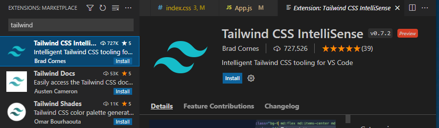
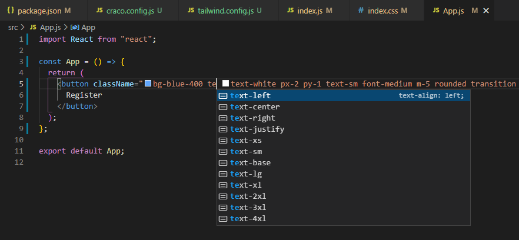

```toc

```

### Creating your project

Create a React project using ~~create-react-app~~:

```sh {numberLines}
npx create-react-app ecom
```

In the code snippet above, ~~ecom~~ is the name of the project.

### Install Tailwind via npm

Install Tailwind and its peer-dependencies using ~~npm~~.

```sh {numberLines}
npm install -D tailwindcss postcss autoprefixer
```

> The ~~-D~~ flag is the shortcut for ~~--save-dev~~.

> PostCSS is a different sort of preprocessor. Like Sass or Less, it parses a source file and outputs a processed CSS file. PostCSS however is entirely plugin-based. Without any plugins, the output file would be an unchanged copy of the source file. The functionality that you get out of PostCSS is entirely determined by the plugin that you use. Perhaps the most important plugin for PostCSS is Autoprefixer, which adds all the appropriate vendor prefixes to your CSS.

### Create your configuration file

Next, run the \_init_command to generate both ~~tailwind.config.js~~ and ~~postcss.config.js~~.

```sh {numberLines}
npx tailwindcss init -p
```

The command will create a minimal ~~tailwind.config.js~~ file at the root of your project:

```js:title=tailwind.config.js {numberLines}
module.exports = {
content: [
    "./src/**/*.{js,jsx,ts,tsx}",
  ],
  theme: {
    extend: {},
  },
  plugins: [],};
```

### Include Tailwind in your CSS

Open the ~~./src/index.css~~ file that Create React App generates for you by default and use the ~~@tailwind~~ directive to include Tailwind’s ~~base~~, ~~components~~, and ~~utilities~~ styles, replacing the original file contents:

```css:title=src/index.css {numberLines}
@tailwind base;
@tailwind components;
@tailwind utilities;
```

Tailwind will swap these directives out at build-time with all of the styles it generates based on your configured design system.

Finally, ensure that the CSS file is imported in your ~~./src/index.js~~ file:

```js:title=src/index.js {numberLines, 3-3}
import React from 'react';
import ReactDOM from 'react-dom';
import './index.css';
import App from './App';
import reportWebVitals from './reportWebVitals';

ReactDOM.render(
  <React.StrictMode>
    <App />
  </React.StrictMode>,
  document.getElementById('root')
);

reportWebVitals();
```

We are finished! Now when you run ~~npm run start~~, Tailwind CSS will be ready to use in your React project.

### Extra - Install Tailwind CSS IntelliSense

If you use Visual Studio Code as your code editor, then you can install the ~~Tailwind CSS IntelliSense~~ extension via the Visual Studio Code marketplace.



It provides users with advanced features such as autocomplete, syntax highlighting, and linting.



> In order for the extension to activate, you must have ~~tailwindcss~~ installed and a Tailwind config file named ~~tailwind.config.js~~ in your workspace.
