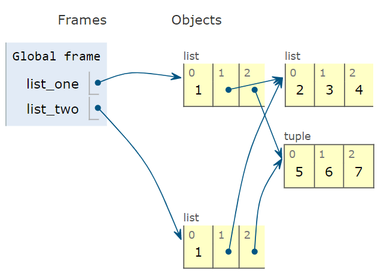

```toc

```

### Shallow copy

We will understand the concept of shallow copy and deep copy in Python using an example of the _list_ data structure.

```py {numberLines}
list_one = [1, [2, 3, 4], (5, 6, 7)]

list_two = list_one[:]

print(list_one == list_two)
# True

print(list_two is list_one)
# False
```

In the code example above. ~~list_one[:]~~ creates a new copy, to which we assign the label ~~list_two~~.

> Note that we can also create a copy using the ~~list~~ constructor: ~~list_two = list(list_one)~~.

**Both the lists are equal (in terms of the values they hold), but refer to two different objects in memory.**

###### Learn how to check the identity of objects in my blog post [here](https://hemanta.io/is-operator-and-id-function-in-python/).

Whenever we create a copy of a list (_or any other mutable sequence in Python_) using the ~~list~~ constructor (~~list~~) or slicing operation (~~[:]~~), we create a shallow copy. Hence, ~~list_two~~ is a shallow copy of ~~list_one~~.

What does shallow copy mean?

It means that we have duplicated only the outermost container; however, the items inside the copy (~~list_two~~) refer to the same items held by the source list (~~list_one~~).

The following diagram represents the state of our program after we created a copy of ~~list_one~~.



Notice how, the inner mutable sequences of ~~list_two~~ refer to the same inner mutable sequences held by ~~list_one~~.

> I created this visualization at ~~www.pythontutor.com~~. This site helps you visualize the changing state of your program as each line of code is executed. You must check it out.

Let’s add an item to the inner list of ~~list_one~~ and see whether that change is reflected in ~~list_two~~.

```py {numberLines}
list_one = [1, [2, 3, 4], (5, 6, 7)]

list_two = list_one[:]

list_one[1].append(8)

print(list_two)
# [1, [2, 3, 4, 8], (5, 6, 7)]
```

On line 5, we added 8 to the inner list (accessible via ~~list_one[1]~~) of ~~list_one~~.

Because ~~list_two~~ is a shallow copy of ~~list_one~~, the inner list of ~~list_two~~ (accessible via ~~list_two[1]~~) is bound to the inner list (accessible via ~~list_one[1]~~) of ~~list_one~~. Therefore the changes we made to the inner list of ~~list_one~~ is reflected in the inner list of ~~list_two~~.

Keep in mind this concept of shallow copy in order to avoid nasty surprises in your program.

### Deep copy

The next question is how can we create deep copies, copies that don’t share references of embedded objects?

We can take the help of the ~~copy~~ module that provides ~~deepcopy~~ and ~~copy~~ functions that return deep and shallow copies respectively of arbitrary objects.

Let’s again create a copy of ~~list_one~~, this time however using the ~~deepcopy~~ function from the ~~copy~~ module.

```py {numberLines}
from copy import copy, deepcopy

list_one = [1, [2, 3, 4], (5, 6, 7)]

list_two = deepcopy(list_one)

list_one[1].append(8)

print(list_two)
# [1, [2, 3, 4], (5, 6, 7)]
```

Notice that because we created a deep copy, the changes we made to the inner list of ~~list_one~~ was not reflected in ~~list_two~~.

###### Learn how to work with modules and import statement in my blog post [here](https://hemanta.io/python-modules-and-import-statement/).
