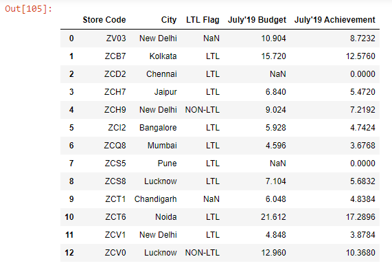
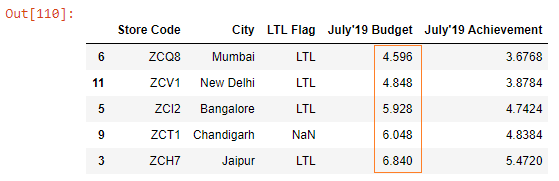
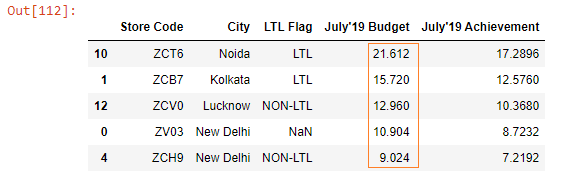

Let’s read an Excel file into a DataFrame:

```py {numberLines}
import pandas as pd

budget = pd.read_excel("budget.xlsx")

budget
```

**Output:**



Let’s say we want to sort the ~~July’19 Budget~~ column.

We can sort the column using the ~~sort_values~~ method.

We pass the name of the column we want to sort to the ~~by~~ parameter. And we pass ~~inplace = True~~ to make permanent changes in the ~~budget~~ DataFrame.

```py {numberLines}
budget.sort_values(by = "July'19 Budget",  inplace = True)

budget.head()
```

**Output:**



By default, the ~~sort_values()~~ method sorts the values in ascending order. If we want to sort in descending order, then we pass a value of ~~False~~ to the ~~ascending~~ parameter.

```py {numberLines}
budget.sort_values(by = "July'19 Budget", ascending = False, inplace = True)

budget.head()
```

**Output:**


