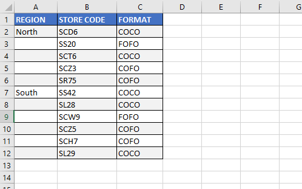

Let’s say we have the following data set:



We can fill the missing labels using the ~~Sub~~ procedure below:

```vb {numberLines}
Sub FillCellTypeBlanks()

Range("A1").CurrentRegion.SpecialCells(xlCellTypeBlanks).FormulaR1C1 = "=R[-1]C"

Range("A1").CurrentRegion.Value = Range("A1").CurrentRegion.Value

End Sub
```

**Line-3:** ~~Range(“A1”).CurrentRegion~~ refers to the contiguous data in the report. The ~~SpecialCells~~ method returns just the blank cells in the range. The formula fills in all the blank cells with a formula that points to the cell above the blank cell.

**Line-5:** This is a fast way to simulate using the Copy & Paste Special Values commands.
