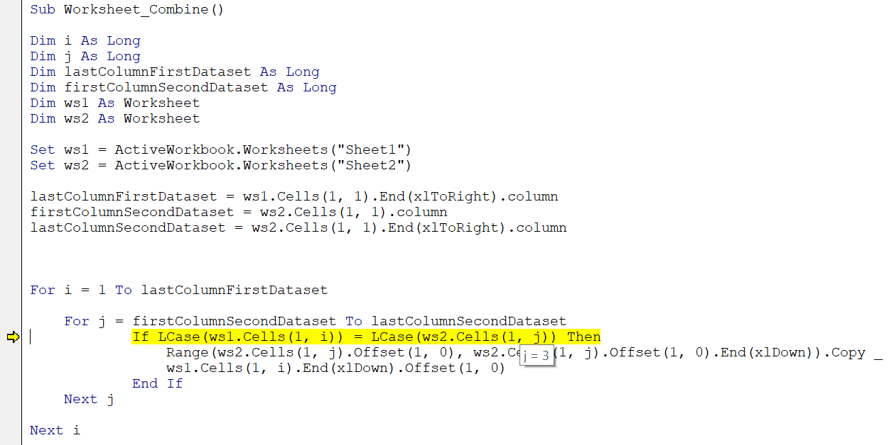
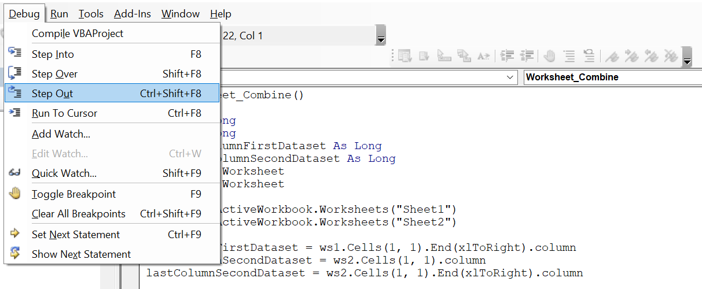
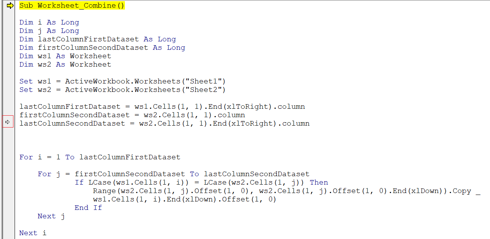

VBA offers several tools to help you "debug" your code. In programming, debugging means finding and correcting possible errors in code.

One of the more useful debugging tools is the ability to step through your code one line at a time. When you step through code, you’re literally watching as each line executes.

To step through your code, place your cursor anywhere within your macro and press F8. Your macro goes into debug mode.

The first line of code is highlighted and a small arrow appears in the Code window’s left margin. Press F8 again to execute the highlighted line of code and move to the next line. You can keep pressing F8 to watch each line be executed until the end of the macro.

**As a bonus, while stepping through the code, you can hover over any string or integer variable to see the current value of that variable.**

To get out of debug mode, choose Debug ⇒   Step Out.

You can also step to a specific line in your code. When a line of code is highlighted in debug mode, you can click and drag the arrow in the left margin of the code window upward or downward, dropping it at whichever line of code you want to execute next.

