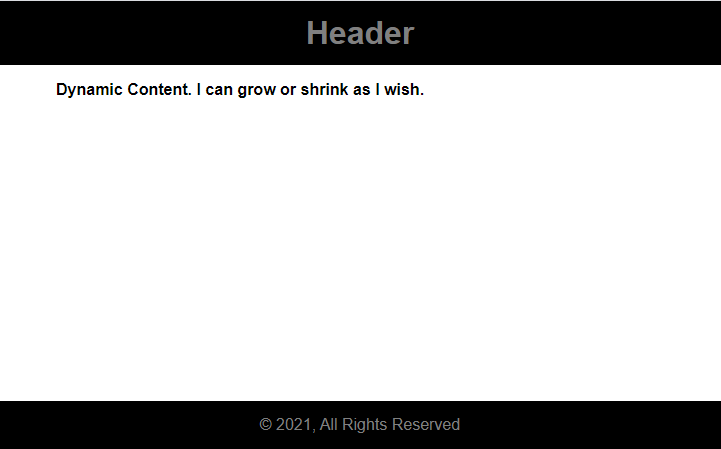

### Requirement

- Footer sticks to the bottom of the viewport when content is short.
- If the content extends past the viewport bottom, the footer sits below the content as normal.

### Using CSS Grid Layout

```jsx:title=src/App.js {numberLines}
import React from "react";

const App = () => {
  return (
    <div className="wrapper">
      <header>Header</header>
      <main>Dynamic Content. I can grow or shrink as I wish.</main>
      <footer>&copy; 2021, All Rights Reserved</footer>
    </div>
  );
};

export default App;
```

```css:title=src/index.css {numberLines, 12-14}
* {
  padding: 0;
  margin: 0;
  box-sizing: border-box;
}

html {
  font-family: sans-serif;
}

.wrapper {
  min-height: 100vh;
  display: grid;
  grid-template-rows: auto 1fr auto;
}

header {
  width: 100%;
  height: 4rem;
  display: grid;
  place-items: center;
  background-color: black;
  color: gray;
  font-size: 2rem;
  font-weight: bolder;
}

main {
  width: 40rem;
  margin: 0rem auto;
  padding: 1rem;
  font-weight: bold;
}

footer {
  width: 100%;
  height: 3rem;
  display: grid;
  place-items: center;
  background-color: black;
  color: gray;
}
```

We have placed the main dynamic content in the ~~1fr~~ track. The ~~1fr~~ track will take all the available space and will grow to fill the gap.

As we can see, the footer sticks to the bottom of the viewport.



### Using Flexbox

We can also create a sticky footer using Flexbox.

```css:title=src/index.css {numberLines, 12-14, 26-26, 34-34, 44-44}
* {
  padding: 0;
  margin: 0;
  box-sizing: border-box;
}

html {
  font-family: sans-serif;
}

.wrapper {
  min-height: 100vh;
  display: flex;
  flex-direction: column;
}

header {
  width: 100%;
  height: 4rem;
  display: grid;
  place-items: center;
  background-color: black;
  color: gray;
  font-size: 2rem;
  font-weight: bolder;
  flex-shrink: 0;
}

main {
  width: 40rem;
  margin: 0rem auto;
  padding: 1rem;
  font-weight: bold;
  flex-grow: 1;
}

footer {
  width: 100%;
  height: 3rem;
  display: grid;
  place-items: center;
  background-color: black;
  color: gray;
  flex-shrink: 0;
}
```

~~flex-shrink:0~~ prevents the header and the footer from shrinking smaller when content fills the main araea.
