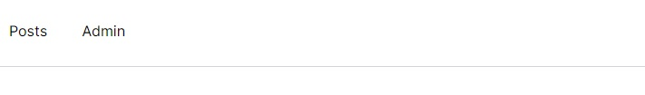
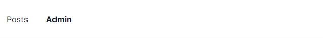

Below, we have a navbar with 2 links: ~~posts~~ & ~~admin~~.



```jsx {numberLines, 3-8}
<nav className="w-full h-20 bg-white border-b border-gray-300">
  <ul className="w-40 h-20 p-4 flex justify-between items-center list-none">
    <NavLink to="/posts">
      <li>Posts</li>
    </NavLink>
    <NavLink to="/admin">
      <li>Admin</li>
    </NavLink>
  </ul>
</nav>
```

**To style the currently active link, we can pass a function to ~~className~~.**

> **Note:** A ~~\<NavLink>~~ is a special kind of ~~\<Link>~~ that knows whether or not it is "active".

```jsx {numberLines, 5-7, 13-15}
<nav className="w-full h-20 bg-white border-b border-gray-300">
  <ul className="w-40 h-20 p-4 flex justify-between items-center list-none">
    <NavLink
      to="/posts"
      className={({ isActive }) =>
        isActive ? "font-bold text-gray-900 underline" : "text-gray-900"
      }
    >
      <li>Posts</li>
    </NavLink>
    <NavLink
      to="/admin"
      className={({ isActive }) =>
        isActive ? "font-bold text-gray-900 underline" : "text-gray-900"
      }
    >
      <li>Admin</li>
    </NavLink>
  </ul>
</nav>
```



> Note that I am using Tailwind CSS utility classes for styling.
