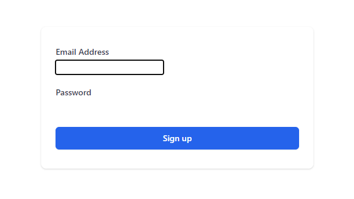

Below, we have the markup for a simple sign up form with two input fields: Email Address and Password.

```jsx:title=src/App.js {numberLines}
import React from "react";

const App = () => {
  return (
    <div className="w-1/3 mx-auto mt-20 bg-white py-8 px-6 shadow rounded-lg">
      <form>
        <div className="mb-5">
          <label
            htmlFor="emailAddress"
            className="block text-sm font-medium text-gray-700"
          >
            Email Address
          </label>
          <div className="mt-1">
            <input id="emailAddress" name="emailAddress" type="email"></input>
          </div>
        </div>

        <div className="mb-5">
          <label
            htmlFor="emailAddress"
            className="block text-sm font-medium text-gray-700"
          >
            Password
          </label>
          <div className="mt-1">
            <input
              id="password"
              name="password"
              type="password"
            ></input>
          </div>
        </div>
        <div>
          <button
            type="submit"
            className="w-full py-2 px-4 border border-transparent rounded-md shadow-sm
            text-sm font-medium text-white
          bg-blue-600 hover:bg-blue-700 focus:outline-none
            focus:ring-2 focus:ring-offset-2 focus:ring-blue-500"
          >
            Sign up
          </button>
        </div>
      </form>
    </div>
  );
};

export default App;
```


In the form above, we don’t see any input fields. This is because we have not added any utility classes to them. They are unstyled.

We will be able to see the input form fields only when we tab through them by pressing the _tab_ key on the keyboard.



We could easily style the input elements using utility classes. However, we will use Tailwind’s official form [plugin](https://github.com/tailwindlabs/tailwindcss-forms), which adds an opinionated form reset layer that makes it easier to style form elements with utility classes.

First, we will install the plugin from npm.

```sh {numberLines}
npm install @tailwindcss/forms
```

Now that the plugin is installed, we will require it in the _plugins_ array in the ~~tailwind.config.js~~ file.

```js:title=tailwind.config.js {numberLines, 10-10}
module.exports = {
  purge: ["./src/**/*.{js,jsx,ts,tsx}", "./public/index.html"],
  darkMode: false,
  theme: {
    extend: {},
  },
  variants: {
    extend: {},
  },
  plugins: [require("@tailwindcss/forms")],
};
```

Now we can see that the plugin has applied simple default styles to our input form elements.


Let’s customise the input elements by adding some utility classes:

```jsx:title=src/App.js {numberLines, 19-19, 36-36}
import React from "react";

const App = () => {
  return (
    <div className="w-1/3 mx-auto mt-20 bg-white py-8 px-6 shadow rounded-lg">
      <form>
        <div className="mb-5">
          <label
            htmlFor="emailAddress"
            className="block text-sm font-medium text-gray-700"
          >
            Email Address
          </label>
          <div className="mt-1">
            <input
              id="emailAddress"
              name="emailAddress"
              type="email"
              className="w-full border-gray-300 rounded-lg shadow-sm focus-border-blue-500 focus-ring-blue-500"
            ></input>
          </div>
        </div>

        <div className="mb-5">
          <label
            htmlFor="emailAddress"
            className="block text-sm font-medium text-gray-700"
          >
            Password
          </label>
          <div className="mt-1">
            <input
              id="password"
              name="password"
              type="password"
              className="w-full border-gray-300 rounded-lg shadow-sm focus-border-blue-500 focus-ring-blue-500"
            ></input>
          </div>
        </div>
        <div>
          <button
            type="submit"
            className="w-full py-2 px-4 border border-transparent rounded-md shadow-sm
            text-sm font-medium text-white
          bg-blue-600 hover:bg-blue-700 focus:outline-none
            focus:ring-2 focus:ring-offset-2 focus:ring-blue-500"
          >
            Sign up
          </button>
        </div>
      </form>
    </div>
  );
};

export default App;
```

Here is how our final form looks like:


