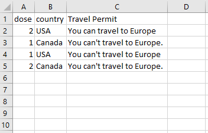
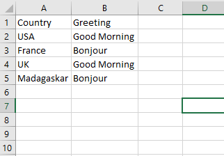

```toc

```

Logical operators compare ~~Boolean~~ expressions and return a ~~Boolean~~ result.

### And

The ~~And~~ operator performs logical _conjunction_ on two ~~Boolean~~ expressions. If both expressions evaluate to ~~True~~, then ~~And~~ returns ~~True~~. If at least one of the expressions evaluates to ~~False~~, then ~~And~~ returns ~~False~~.

```vb {numberLines}
Function TravelPermit(dose, country) As String
If dose = 1 And country = "USA" Then
    TravelPermit = "You can't travel to Europe"
ElseIf dose = 2 And country = "USA" Then
    TravelPermit = "You can travel to Europe"
Else
    TravelPermit = "You can't travel to Europe."
End If
End Function
```



### Or

The ~~Or~~ operator performs logical _disjunction_ on two ~~Boolean~~ expressions. If either expression evaluates to ~~True~~, or both evaluate to ~~True~~, then ~~Or~~ returns ~~True~~. If neither expression evaluates to ~~True~~, ~~Or~~ returns ~~False~~.

```vb {numberLines}
Function Greeting(country) As String

If country = "France" Or country = "Madagaskar" Then
    Greeting = "Bonjour"
ElseIf country = "USA" Or country = "UK" Then
    Greeting = "Good Morning"
End If

End Function
```


