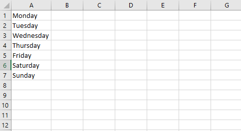
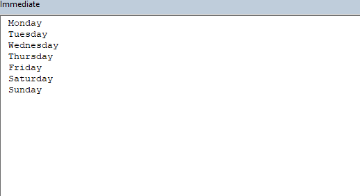
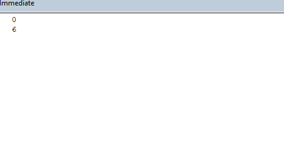
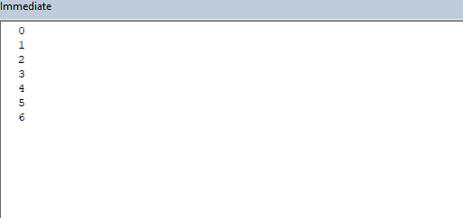

```toc

```

An array is a data structure that can hold a set of values.

### Declaring an array

We declare an array beginning with the ~~Dim~~ keyword, followed by the name of the array, followed by the index position of the last element in the array enclosed in parentheses, followed by the ~~As~~ keyword, followed by the data type of each element in the array.

Let’s say we want to create an array named ~~daysofweek~~, which will hold, as the name suggests, the seven days of the week.

```vb {numberLines}
Sub ArrayDemo()

Dim daysofweek(6) As String

End Sub
```

> By default an array is indexed beginning with 0. We can change the default index of the first element from 0 to 1 by using the ~~Option Base~~ statement at the top of a module.

```vb {numberLines}
Option Base 1
```

When declaring arrays, we can also explicitly set the lower bound by using a ~~To~~ clause, as shown in the following example:

```vb {numberLines}
Sub ArrayDemo()

Dim daysofweek(0 To 6) As String

End Sub
```

~~Dim daysofweek(6) As String~~ & ~~Dim daysofweek(0 To 6) As String~~: Both of these statements will produce the same 7-element array.

### Adding elements to the array

After we declare the array, we can add elements to the array by writing the name of the array followed by the index number of the element we want to write the value to, enclosed in parentheses.

```vb {numberLines, 5-11}
Sub days()

Dim daysofweek(6) As String

daysofweek(0) = "Monday"
daysofweek(1) = "Tuesday"
daysofweek(2) = "Wednesday"
daysofweek(3) = "Thursday"
daysofweek(4) = "Friday"
daysofweek(5) = "Saturday"
daysofweek(6) = "Sunday"

End Sub
```

Let's say that the elements that we added to the ~~dayofweek~~ array are there in a range, as shown below:



In such a case, we can loop through the range and add the elements to the array, as shown in the example below:

```vb {numberLines, 5-12}
Sub ArrayDemo()

Dim daysofweek(6) As String

Dim LastRow As Long
Dim i As Long

LastRow = Cells(Rows.Count, 1).End(xlUp).Row

For i = 1 To LastRow
    daysofweek(i - 1) = Cells(i, 1).Value
Next i

End Sub
```

After executing the procedure above, the ~~daysofweek~~ array gets populated with the values present in the range A1:A7. Let's prove this by printing the array elements to the immediate window:

```vb {numberLines, 14-20}
Sub ArrayDemo()

Dim daysofweek(6) As String

Dim LastRow As Long
Dim i As Long

LastRow = Cells(Rows.Count, 1).End(xlUp).Row

For i = 1 To LastRow
    daysofweek(i - 1) = Cells(i, 1).Value
Next i

Debug.Print (daysofweek(0))
Debug.Print (daysofweek(1))
Debug.Print (daysofweek(2))
Debug.Print (daysofweek(3))
Debug.Print (daysofweek(4))
Debug.Print (daysofweek(5))
Debug.Print (daysofweek(6))

End Sub
```



### LBound & UBound

We use the ~~LBound~~ function to find the lower limit and the ~~UBound~~ function to find the upper limit of an array’s dimension.

The default value of lower limit for an array is 0 (assuming we have not changed the default index using the ~~Option Base~~ statement).

Let's find out the lower bound and the upper bound of the ~~daysofweek~~ array:

```vb {numberLines}
Sub ArrayDemo()

Dim daysofweek(6) As String

Dim LastRow As Long
Dim i As Long

LastRow = Cells(Rows.Count, 1).End(xlUp).Row

For i = 1 To LastRow
    daysofweek(i - 1) = Cells(i, 1).Value
Next i

Debug.Print (LBound(daysofweek))
Debug.Print (UBound(daysofweek))

End Sub
```



### Looping through an array

We will make use of the ~~LBound~~ and ~~UBound~~ functions to loop through the ~~daysofweek~~ array and print the results to the immediate window.

```vb {numberLines}
Dim daysofweek(6) As String

Dim LastRow As Long
Dim i As Long
Dim j As Long

LastRow = Cells(Rows.Count, 1).End(xlUp).Row

For i = 1 To LastRow
    daysofweek(i - 1) = Cells(i, 1).Value
Next i

For j = LBound(daysofweek) To UBound(daysofweek)
    Debug.Print (j)
Next j

End Sub
```


