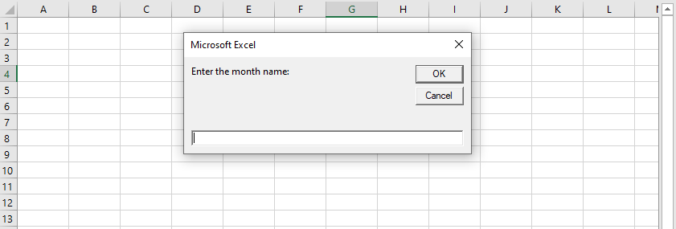

The ~~InputBox~~ function displays a prompt in a dialog box, waits for the user to input text or click a button and returns a ~~String~~ containing the contents of the text box.

**Syntax**

A simplified version of the ~~InputBox~~ function’s syntax is as follows:

```vb {numberLines}
InputBox(prompt, [title], [default])
```

- ~~prompt~~: The text displayed in the message box.

- ~~title~~: The text displayed in the input box’s title bar (_optional_).

- ~~default~~: The default value for the user’s input (_optional_).

The following procedure asks for the month name from the user and then prints the name to the immediate window.

```vb {numberLines}
Sub InputBoxDemo()

    Dim month As String

    month = InputBox("Enter the month name:")

    Debug.Print month

End Sub
```



When the user enters a name, the procedure assigns the month name to the ~~month~~ variable. Note that we have only provided the first argument (_prompt_) to the function.

The InputBox always displays a ~~Cancel~~ button. If the user clicks on ~~Cancel~~, the ~~InputBox~~ function returns an empty string.
