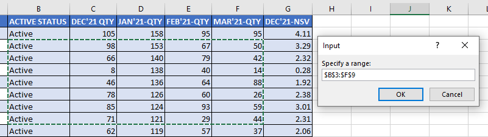

###### Learn about the InputBox function in my blog post [here](https://hemanta.io/the-inputbox-function-in-excel-vba/).

The ~~InputBox~~ method is a method of the ~~Application~~ object.

One big advantage of using the ~~Application~~ ~~InputBox~~ method is that your code can prompt for a range selection. The user can then select the range in the worksheet by highlighting the cells.

Here’s a quick example that prompts the user to select a range:

```vb {numberLines}
Sub GetRange()

Dim Rng As Range

On Error Resume Next

Set Rng = Application.InputBox(prompt:="Specify a range:", Type:=8)

If Rng Is Nothing Then Exit Sub

MsgBox "You selected range " & Rng.Address

End Sub
```

The following figure shows how it looks:



In this simple example, the code tells the user the address of the range that was selected. In real life, your code would actually do something useful with the selected range.
