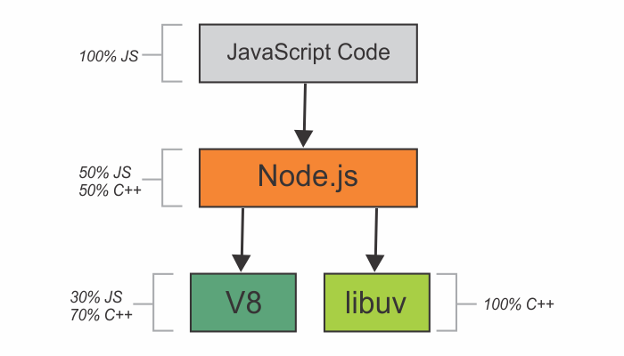

Node.js is a JavaScript runtime built on Chrome’s V8 Javascript engine.

Internally, Node.js uses a collection of dependencies to execute our code. Two of the most important dependencies are **V8** & **libuv**.

- **V8** is an open source JavaScript engine created by Google. It helps us execute JavaScript code outside of the browser.

- **libuv** is a library that provides mechanisms to handle file system, DNS, network, child processes, pipes, signal handling, polling and streaming. It also includes a thread pool for offloading work for some things that can’t be done asynchronously at the operating system level.

We, as JavaScript developers, don’t want to write C++ code; we want to write JavaScript code. This is where Node.js comes into picture. It provides an interface to relay the JavaScript side of our application to the C++ code that is running on our computer to actually interpret and execute our JavaScript code.

Besides, Node.js gives us a set of wrappers and a unified and consistent API for getting access to functionalities that ultimately are implemented inside V8 & libuv.

