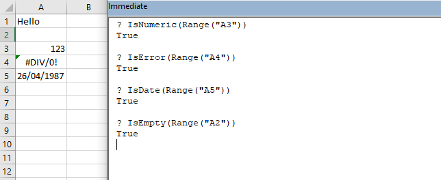

```toc

```

### IsNumeric()

Returns a Boolean value indicating whether an expression can be evaluated as a number.

### IsEmpty()

The ~~IsEmpty~~ function returns a Boolean value that indicates whether a single cell is empty: ~~True~~ if empty, ~~False~~ if not. The cell must truly be empty for the function to return ~~True~~. If it contains even just a space that you cannot see, Excel does not consider the cell to be empty.

### IsDate

Returns ~~True~~ if the expression is a date or is recognizable as a valid date or time; otherwise, it returns ~~False~~.

### IsError

Returns a Boolean value indicating whether an expression is an error value.


