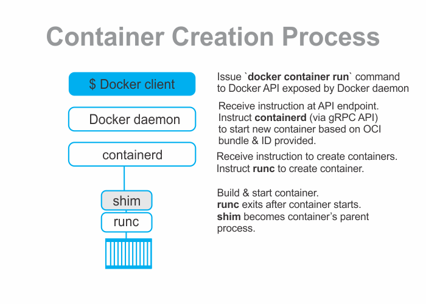

```toc

```



There are four parts to understanding the process of container creation in Docker.

### Part-1

The most common way to start a container is to use the Docker CLI. The following ~~docker container run~~ command will start a simple new container based on the ~~alpine:latest~~ image.

```sh {newLines}
$ docker container run --name ctr1 -it alpine:latest sh
```

When you type commands like this into the Docker CLI, the Docker client converts them into the appropriate API payload and POSTs them to the API endpoint exposed by the Docker _daemon_.
The API is implemented in the _daemon_ and can be exposed over a local socket or the network.

### Part-2

Once the _daemon_ receives the command to create a new container, it makes a call to _containerd_. The _daemon_ communicates with containerd via a CRUD-style API over gRPC.

### Part-3

Despite its name, _containerd_ cannot actually create containers. It uses _runc_ to do that. It converts the required Docker image into an OCI bundle and tells _runc_ to use this to create a new container.

### Part-4

_runc_ interfaces with the OS kernel to pull together all of the constructs necessary to create a container (namespaces, cgroups etc.). The container process is started as a child-process of _runc_, and as soon as it is started, _runc_ will exit.

The container is now started.

###### Understand the Docker Engine architecture in my blog post [here](https://hemanta.io/a-detailed-guide-to-docker-engine/).
