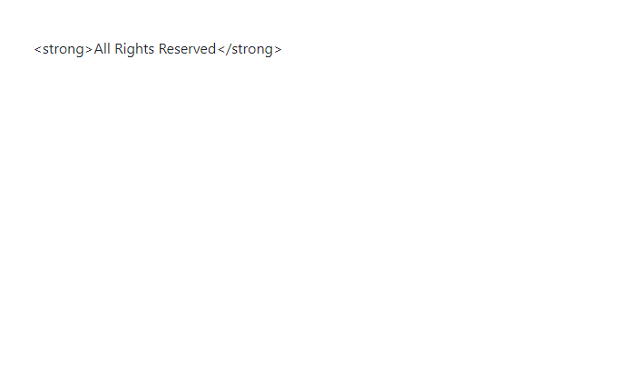

Below, when the ~~App~~ component is rendered, we would expect to see the text ~~All Rights Reserved~~ in bold.

```jsx {numberLines}
import React from "react"

const App = () => {
  const text = "<strong>All Rights Reserved</strong>"
  return <div className="m-5">{text}</div>
}

export default App
```

Instead, what we see is the regular text with \<strong> HTML tags.



This is because **React escapes all the HTML entities in JSX expressions**. This is a security feature that prevents XSS injection.

> Cross-Site-Scripting (XSS) is a security vulnerability when the user is able to inject your page with their own code (HTML, CSS and/or JavaScript).

How can we then override this behavior?

We can do so by adding a prop called ~~dangerouslySetInnerHTML~~, which accepts an object ~~{\_\_html: text}~~, which is wrapped with an expression ~~{ }~~. Note that the key \_\_html is with two underscores.

Let’s update the ~~App~~ component as follows:

```jsx {numberLines, 5}
import React from "react"

const App = () => {
  const text = "<strong>All Rights Reserved</strong>"
  return <div className="m-5" dangerouslySetInnerHTML={{ __html: text }} />
}

export default App
```

Now, we get our desired output:


I have come across the usage of ~~dangerouslySetInnerHTML~~ in Gatsby, a front-end framework powered by React & GraphQL.

Here is a code snippet from my Gatsby blog (_the blog you are reading now_ ) that uses ~~dangerouslySetInnerHTML~~ (line 7).

```js {numberLines, 7}
<div>
  <div className="single_post_page">
    <h1>{post.frontmatter.title}</h1>
    <p className="single_post_page_publishing_details">
      By Hemanta Sundaray on {post.frontmatter.date}
    </p>
    <div dangerouslySetInnerHTML={{ __html: post.html }} />
  </div>
  <div className="pagination">
    {prev && (
      <Link to={prev.fields.slug}>
        {" "}
        <FontAwesomeIcon icon={faArrowLeft} /> Previous
      </Link>
    )}
    {next && (
      <Link to={next.fields.slug}>
        Next <FontAwesomeIcon icon={faArrowRight} />
      </Link>
    )}
  </div>
</div>
```
