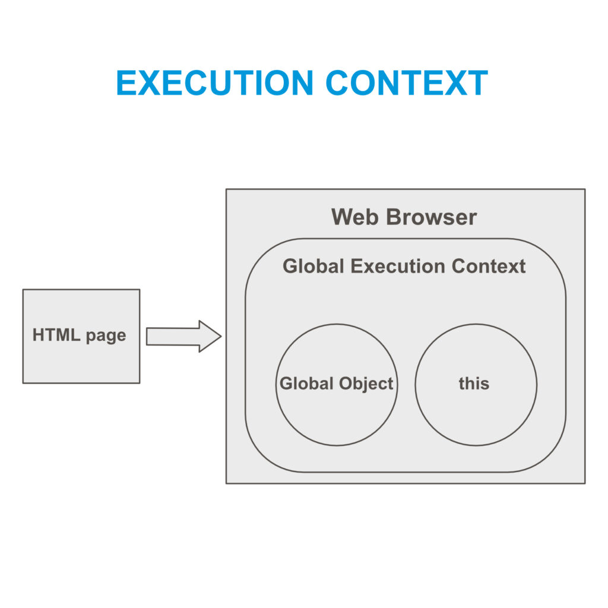
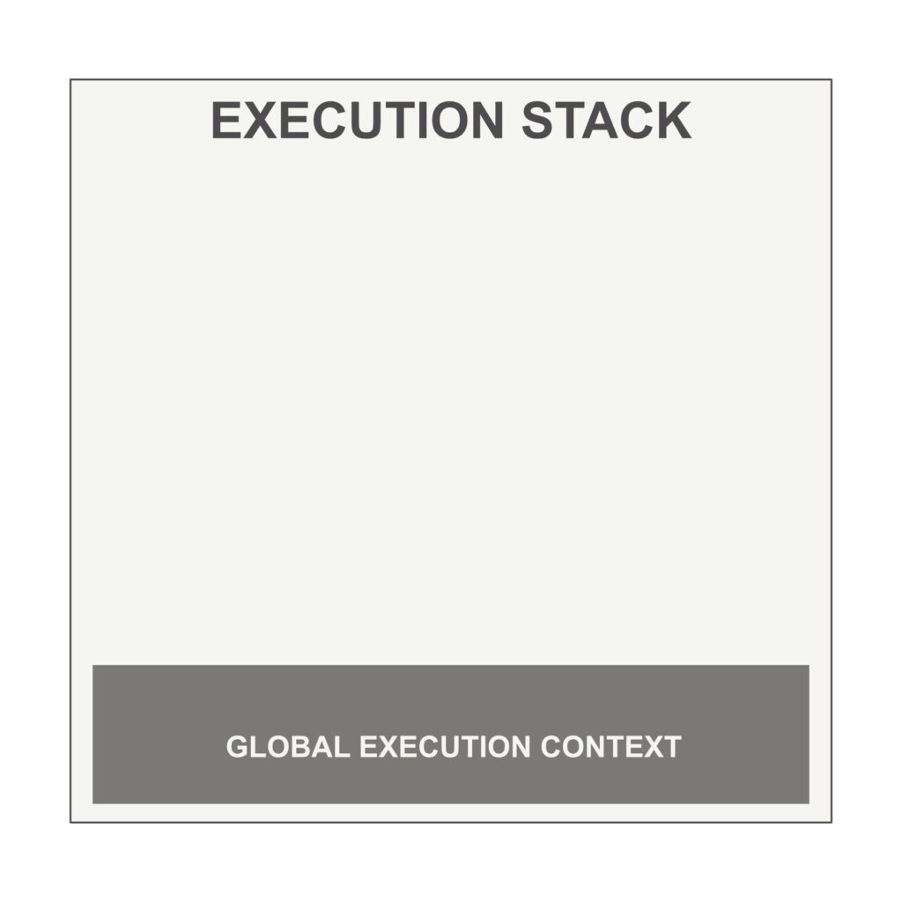
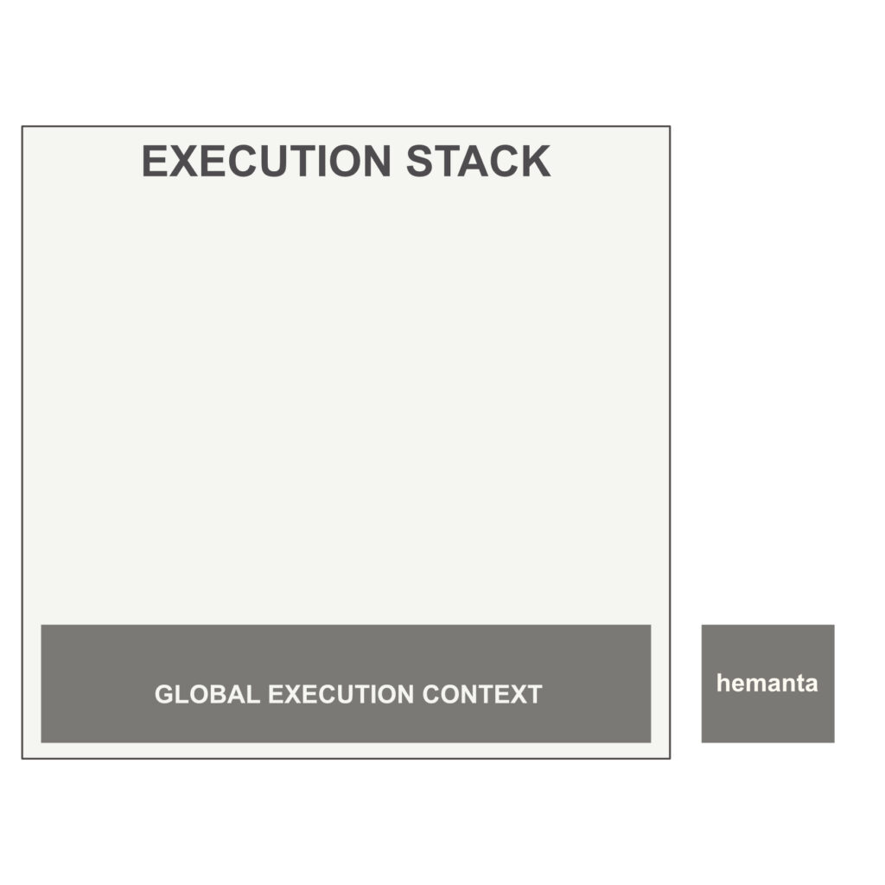
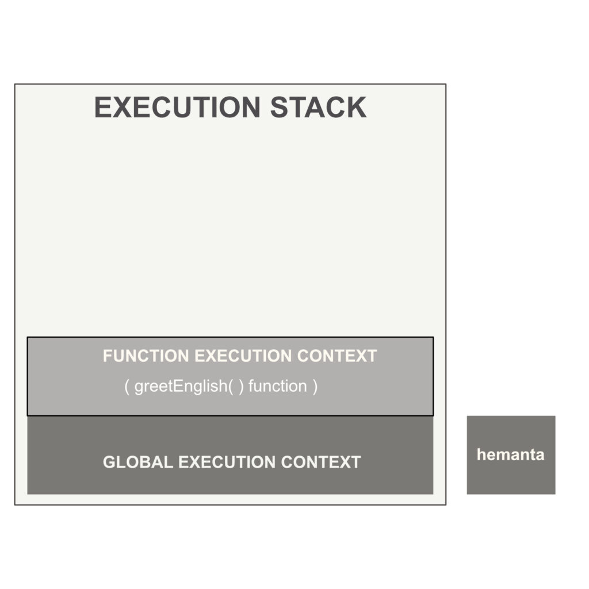
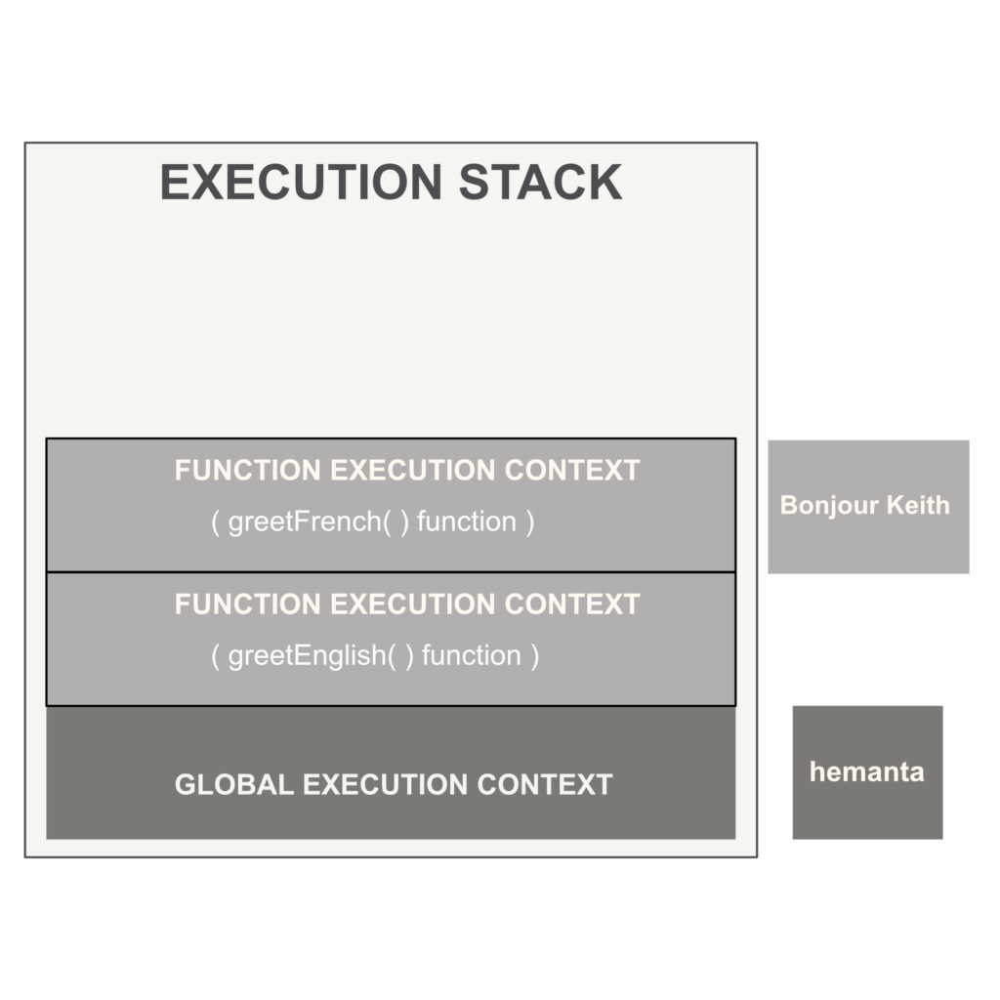
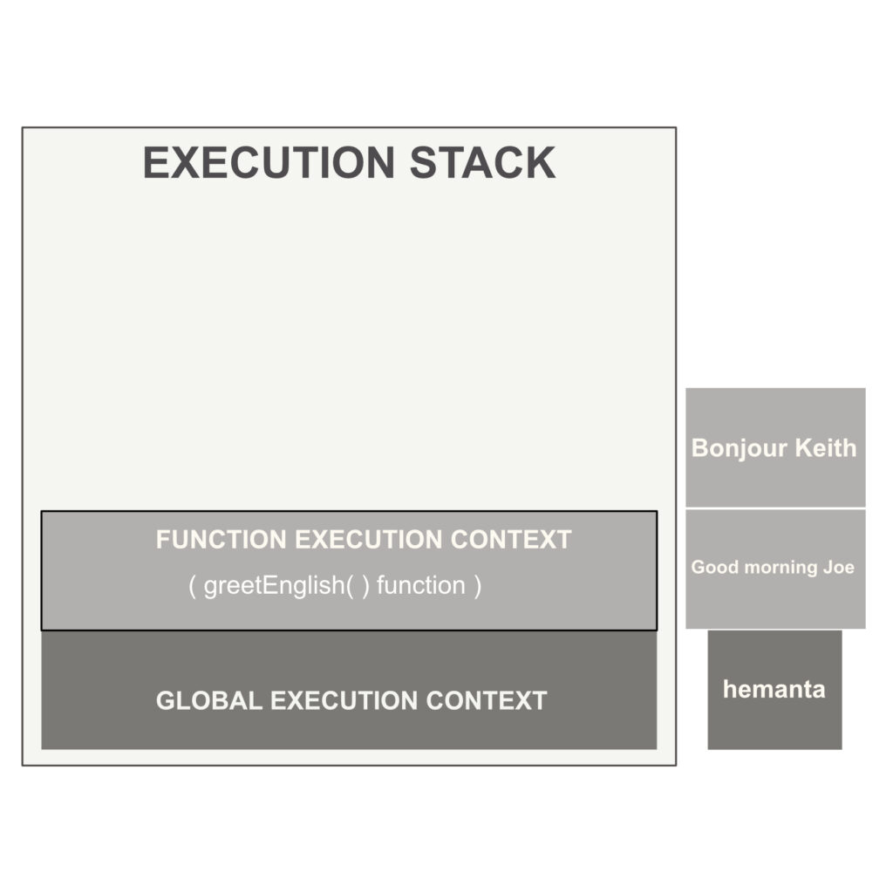
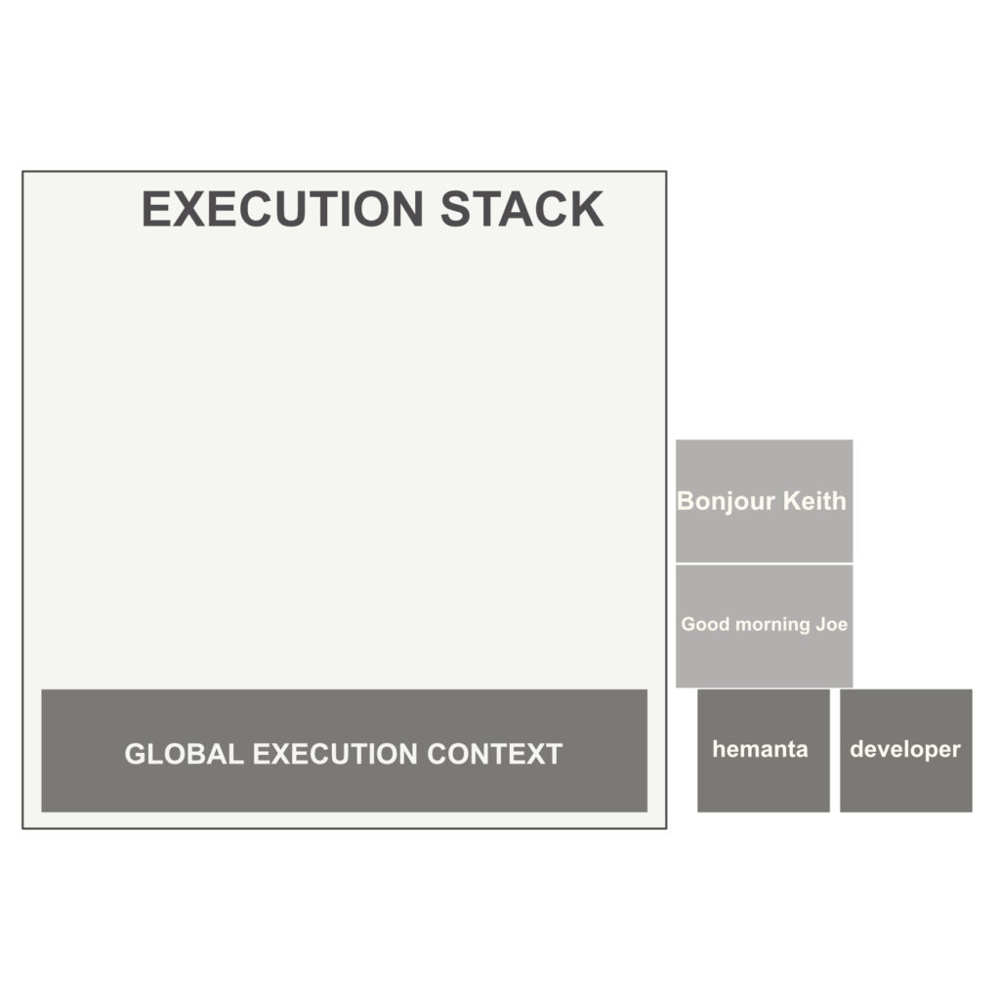

```toc

```

In JavaScript, a function can call another function which in turn can call another function and so on. In a script that has multiple functions like this, the JavaScript interpreter (_that runs in the web browser_) can keep track of its place inside the script through a mechanism called **execution stack**.

We will understand this concept of execution stack by analyzing the sequence of code execution of the following script.

```js {numberLines, 6}
const name = "hemanta"
console.log(name)

function greetEnglish() {
  const name = "Joe"
  greetFrench()
  console.log(`Good morning ${name}`)
}

function greetFrench() {
  const name = "Keith"
  console.log(`Bonjour ${name}`)
}

greetEnglish()

const prof = "developer"

console.log(prof)
```

The code above is nothing special. The only thing to note here is that on line 6, we have called/invoked ~~greetFrench~~ function inside the ~~greetEnglish~~ function.

### Execution context

Before we can understand the concept of execution stack, we need to understand the concept of execution context, which is an environment where JavaScript code gets evaluated and executed.

When a HTML page loads in the web browser, the JavaScript engine prepares an environment for executing JS code. As part of this environment, global execution context is created. And global execution context in turn creates a global ~~window~~ object (_which exists in the global scope_) and a special keyword called ~~this~~, which points to the global ~~window~~ object.



Note that all this happens before execution of any JavaScript code.

### Execution stack

Now, let's understand step-by-step how our script above gets executed by JavaScript.

#### Step-1



We know that when a page gets loaded in the web browser, JavaScript engine creates the global execution context, which manages a script from start to finish and is the first member of the execution stack.

Global execution context creates memory space for variables and functions. All variables are assigned a default value of ~~undefined~~ and all functions are put into memory in their entirety (i.e. their name + their execution code).

Then, the syntax parser of the JavaScript engine checks the code line-by-line and if no syntax error is found, Javascript starts execution of the code.

#### Step-2



JavaScript code that is not inside any function runs in the global execution context. After execution of code on lines 1 & 2, the result ~~hemanta~~ is logged in the console.

#### Step-3



Then, JavaScript engine continues and encounters ~~greetEnglish~~ and ~~greetFrench~~ functions. It does not execute the code inside them, because the functions have simply been declared. They have not been called/invoked yet.

Thereafter on line 15, JavaScript encounters invocation of the ~~greetEnglish~~ function. Then ~~greetEnglish~~ function becomes active. JavaScript creates an execution context for the function and pushes the context to the top of the execution stack.

JavaScript executes the code inside the ~~greetEnglish~~ function and encounters invocation of ~~greetFrench~~ function.

#### Step-4



Then JavaScript creates an execution context for the ~~greetFrench~~ function and pushes it to the top of the execution stack. ~~greetFrench~~ function becomes active. JavaScript executes the code inside it and logs in ~~Bonjour Keith~~ to the console.

#### Step-5



Because there is no more code to run inside the ~~greetFrench~~ function, ~~greetFrench~~ function execution context gets popped off the execution stack and JavaScript returns back control to the calling function - ~~greetEnglish~~ function. ~~greetEnglish~~ function becomes the active function and JavaScript continues executing the rest of the code inside it. JavaScript executes the code on line 7 and logs in ~~Good morning Joe~~ to the console.

#### Step-6



There is no more code to run inside the ~~greetEnglish~~ function. As a result, ~~greetEnglish~~ function gets popped off the execution stack and global execution context continues executing rest of the code inside the script. And on line 19, we get ~~developer~~ as the output in the console, marking the completion of the execution of our script.
