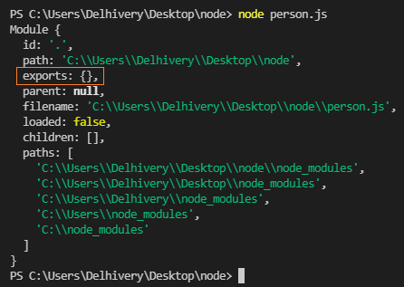
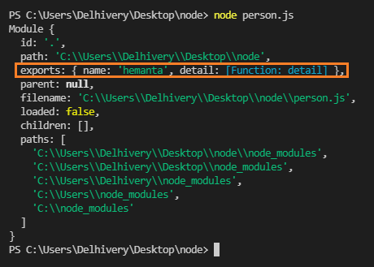
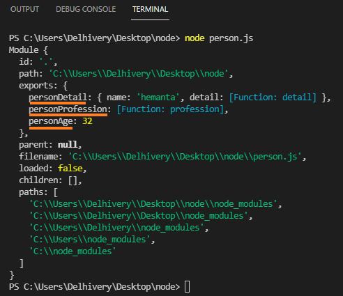

```toc

```

Modules are reusable pieces of code that can be exported from one program and imported for use in another program.

They keep information private and protected from other modules.

### module.exports

Every JavaScript file run in Node has a local ~~module~~ object with an ~~exports~~ property used to define what should be exported from the file. Let’s prove this.

Create a file called ~~person.js~~. Open the file in VS Code. Paste the code below and execute it using the command ~~node person.js~~.

```js:title=person.js
console.log(module)
```



In the output, we see that the ~~module~~ object has an ~~exports~~ property which points to an empty object, because we have not exported anything from the file yet.

Now, let's export an object from the file and execute the file using the command ~~node person.js~~.

```js:title=person.js {numberLines, 8}
const person = {
    name: ‘hemanta’,
    detail( ) {
      console.log(`My name is ${this.name}`);
    }
};

module.exports = person;

console.log(module);
```

On line 8, we export the ~~person~~ object as a module. ~~Module~~ is a variable that represents the module, and ~~exports~~ exposes the module as an object.

Now, we can see in the output below that the ~~exports~~ property points to the ~~person~~ object.



We can also export the ~~person~~ object the following way.

```js:title=person.js {numberLines}
module.exports = {
  name: "hemanta",
  detail() {
    console.log(`My name is ${this.name}`)
  },
}
```

Here, ~~module.exports~~ exposes the current module as an object.

### require()

~~require()~~ is a JavaScript function that loads a module. It’s argument is the file path of the module.

Use ~~require()~~ to import the module into another file.

Create a file called ~~greeting.js~~ and use ~~require()~~ to import the module.

```js:title=greeting.js {numberLines}
// the name of the variable is up to you.
const personDetail = require("./person.js")

function greet() {
  console.log(`Bonjour ${personDetail.name}`)
}

greet() // => Bonjour hemanta
```

### Exporting multiple methods & objects

```js:title=person.js {numberLines, 14-16}
const person = {
  name: "hemanta",
  detail() {
    console.log(`My name is ${this.name}`)
  },
}

function profession() {
  console.log(`${person.name} is a front-end developer.`)
}

const age = 32

exports.personDetail = person
exports.personProfession = profession
exports.personAge = age

console.log(module)
```



Note that the name of the keys (_underlined in orange_) are up to us.

Now, we can import the values we want using ~~require()~~.

```js:title=greeting.js {numberLines, 1}
const { personProfession, age } = require("./person.js")

personProfession() // => hemanta is a front-end developer
```

On line 1, I have used destructuring to import only the values I want.
