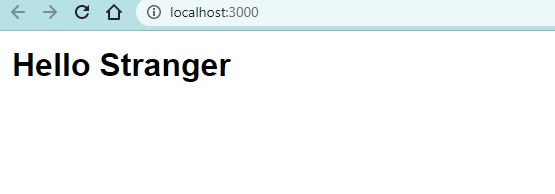

```toc

```

In React every component has something called ~~props~~.

A component’s ~~props~~ is an object. It holds information about that component.

We can pass information to a component by giving the component an attribute.

```js {numberLines, 4-7, 13-13}
import React from "react"
import ReactDOM from "react-dom/client"

const Greeting = props => {
  console.log(props) // {name: 'Hemanta}
  return <h1>Hello {props.name}</h1>
}

export default Greeting

const root = ReactDOM.createRoot(document.getElementById("root"))

root.render(<Greeting name="Hemanta" />)
```

In the example above, we used the attribute ~~name~~ for passing some information to the ~~Greeting~~ component.


### defaultProps

In the example above, ~~Greeting~~ receives a prop named ~~name~~. The received name then gets displayed inside of a ~~\<h1>\</h1>~~ element.

What if we don’t pass any ~~name~~ to ~~Greeting~~?

To avoid such a scenario, we can pass a default ~~name~~ to the ~~Greeting~~ component.

We can make this happen by giving our component a property named ~~defaultProps~~.

The ~~defaultProps~~ property should be equal to an object. And inside the object, we write properties for any default ~~props~~ that we would like to set:

```js {numberLines, 11-12}
import React from "react"
import ReactDOM from "react-dom/client"

const Greeting = props => {
  console.log(props) // {name: 'Hemanta}
  return <h1>Hello {props.name}</h1>
}

export default Greeting

Greeting.defaultProps = {
  name: "Stranger",
}

const root = ReactDOM.createRoot(document.getElementById("root"))

root.render(<Greeting />)
```



> If we need to pass information that is not a string, we need to wrap the information in curly braces.

**Example:**

```js {numberLines}
<Greeting info={["hola", "hello"]} />
```

### props.children

Every component’s ~~props~~ object has a property named ~~children~~. ~~props.children~~ will return everything in between a component’s opening and closing JSX tags.

> **Note:** ~~props~~ is the name of the object that stores passed-in information. At the same time, each piece of passed-in information is called a _prop_. This means that ~~props~~ could refer to two pieces of passed-in information, or it could refer to the object that stores those pieces of information.
