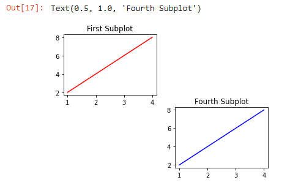

When we have multiple axes in the same figure, we call each set of axes a subplot.

We can have many different subplots in the same figure and we can lay them out in many different ways.

We can think of our layout as having rows and columns of subplots.

We can create a subplot using ~~.subplot()~~.

The command ~~plt.subplot()~~ needs three arguments to be passed into it:

- The number of rows of subplots
- The number of columns of subplots
- The index of the subplot we want to create

Any ~~plt.plot()~~ that comes after ~~plt.subplot()~~ will create a line plot in the specified subplot.

For instance:

```py {numberLines}
import matplotlib.pyplot as plt
# Dataset
x=[1, 2, 3, 4]
y=[2, 4, 6, 8]

# First subplot
plt.subplot(2, 2, 1) # 2 rows * 2 columns
plt.plot(x, y, color="red")
plt.title("First Subplot")


# Fourth subplot
plt.subplot(2, 2, 4)
plt.plot(x, y, color="blue")
plt.title("Fourth Subplot")
```

This would result in a figure with the two plots arranged like this:


