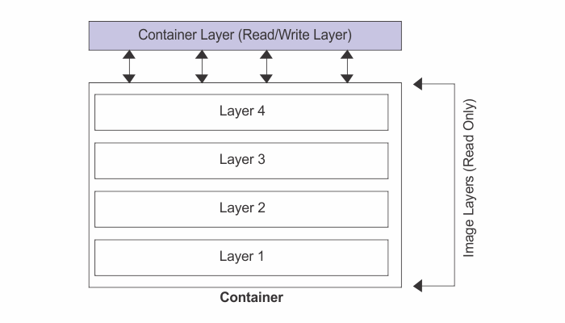
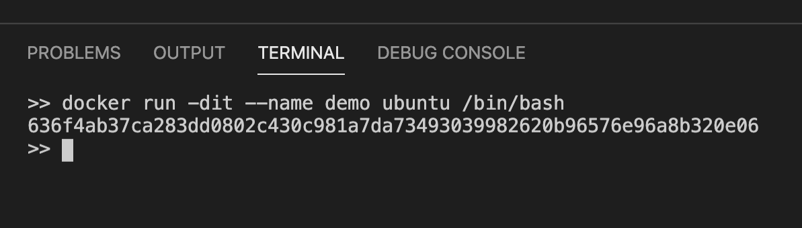
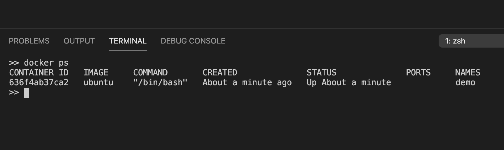
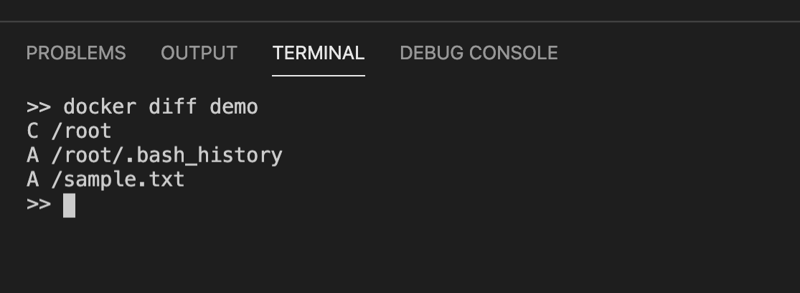

When we create a new container, we add a new writable player on top of the underlying layers. This layer is often called the **Container Layer**. All changes made to the running container, such as writing new files, modifying existing files, and deleting files are written to this thin writable container layer.



When the container is deleted, the writable layer is also deleted. The underlying image remains unchanged.

> The major difference between an image and a container is the top writable layer.

Let’s prove this.

First, we will run a container from the ~~ubuntu~~ base image.

```sh {numberLines}
docker run -dit -–name demo ubuntu /bin/bash
```



```sh {numberLines}
docker ps
```



Our ~~demo~~ container is running. Next, let’s create a bash session using the ~~docker exec~~ command.

```sh
docker exec -it demo /bin/bash
```

Now we will create a new file:

```sh {numberLines}
echo "This is sample text." >  sample.txt
```

Now enter ~~exit~~, hit ~~enter~~ and we will be back to the host terminal. Let’s use the ~~docker diff~~ command to find out what has changed in the container’s file system in relation to the file system of the original image, as shown below:

```sh {numberLines}
Docker diff demo
```



We can clearly see from the output that a new file has been added to the container’s file system. Since we know that image layers are read-only (that is they are immutable), the change could have only happened in the writable container layer.

If we now delete the container, its container layer will also be removed and with it all the changes will be irreversibly changed.

If we need our changes to persist even beyond the lifetime of the container, we need to use Docker volumes.
