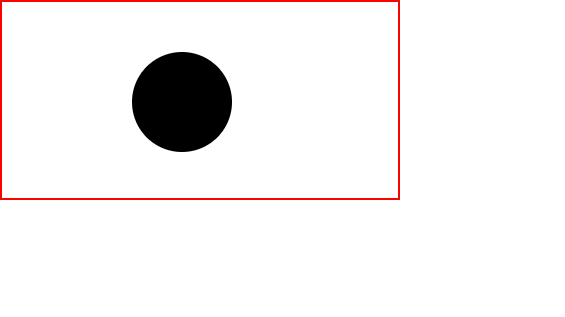
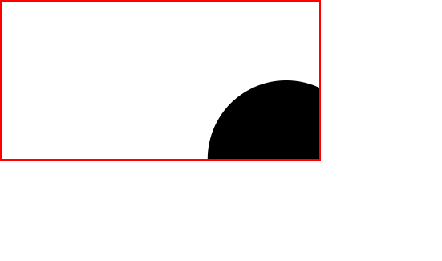
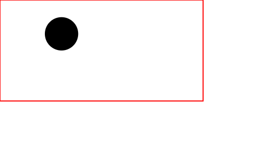

```toc

```

### SVG Canvas

The canvas is the area or space where the SVG graphic is drawn. In theory, this canvas is infinite in both dimensions.

The part of the canvas we intend to use is called the **viewport**. The SVG graphic may be entirely or partially visible through the viewport.

### Size of the viewport

We specify the size of the viewport using the ~~width~~ and ~~height~~ attributes on the outermost \<svg> element.

```html {numberLines, 12-15}
<!DOCTYPE html>
<html lang="en">
  <head>
    <meta charset="UTF-8" />
    <meta http-equiv="X-UA-Compatible" content="IE=edge" />
    <meta name="viewport" content="width=device-width, initial-scale=1.0" />
    <title>SVG Fundamentals</title>
    <link rel="stylesheet" href="style.css" />
  </head>
  <body>
    <!-- the viewport will be 400px by 200px -->
    <svg width="400" height="200">
      <!-- SVG content drawn onto the SVG canvas -->
      <circle cx="180" cy="100" r="50" />
    </svg>
  </body>
</html>
```

```css {numberLines}
svg {
  border: 0.2rem solid red;
}
```



Once the width and height attributes of the outermost SVG element are set, the browser establishes an initial _viewport coordinate system_ and an initial _user coordinate system_.

### The viewport coordinate system

The initial viewport coordinate system is a coordinate system established on the viewport, with origin at the top left corner of the viewport at point (0, 0).

The positive x-axis points towards the right. The positive y-axis points downwards.

### The user coordinate system

The initial user coordinate system is the coordinate system established on the SVG canvas. By default, both the viewport coordinate system and the user coordinate system align with each other - meaning, both the coordinate systems have their origin at the top left corner of the viewport, with the positive x-axis pointing towards the right and the positive y-axis pointing downwards.

We can specify our own user coordinate system using the ~~viewBox~~ attribute. If the user coordinate system we choose has the same aspect ratio (ratio of height to width) as the viewport coordinate system, it will stretch to fill the viewport area.

### viewBox

The ~~viewBox~~ attribute takes four parameters: ~~min-x~~, ~~min-y~~, ~~width~~ & ~~height~~.

```sh
viewBox = min-x min-y width height
```

The ~~min-x~~ and ~~min-y~~ values determine the upper-left corner of the viewbox and the ~~width~~ and ~~height~~ determine the width and height of that viewbox.

#### aspect ratio of the viewBox is equal to the aspect ratio of the viewport.

Consider the example below:

```html {numberLines}
<svg width="400" height="200" viewBox="0 0 200 100">
  <circle cx="180" cy="100" r="50" />
</svg>
```

- The aspect ratio of the viewport = 0.5 (200/400).
- The aspect ratio of the viewbox = 0.5 (100/200)

In the example above, the width and height of the viewbox is half of the width and height of the viewbox. However, the aspect ratio of the viewbox is equal to the aspect ratio of the viewport.

What does ~~viewBox="0 0 200 100"~~ do?



- It specifies a specific region on the SVG canvas spanning from a top-left point at (0, 0) to a point at (200, 100).
- The SVG graphic is then cropped to that region
- The region is scaled up (in a zoom-in like effect) to fill the entire viewport.
- The user coordinate system gets scaled up to 200 x100. Then, it gets mapped to the viewport coordinate system, so that every x-unit in the user coordinate system is equal to **viewport-width / viewbox-width** horizontally and **viewport-height / viewbox-height** units vertically in the viewport coordinate system. This means that every 1 x-unit in the user coordinate system is equal to 2 x-units in the viewport coordinate system and every 1 y-unit in the user coordinate system is equal to 2 y-units in the viewport coordinate system.

Let’s consider another example where the width and height of the viewbox is larger than the viewport, but the aspect ratio of the viewbox is equal to the aspect ratio of the viewport.

In the example below, we have made the viewbox 1.5 times the size of the viewport.

```html {numberLines}
<svg width="400" height="200" viewBox="0 0 600 300">
  <circle cx="180" cy="100" r="50" />
</svg>
```

The result of the code above is as follows:



- The user coordinate system gets scaled up to 600 \* 300
- Then, it gets mapped to the viewport coordinate system, so that every x-unit in the user coordinate system is equal to **viewport-width/viewbox-width** horizontally and **viewport-height/viewbox-height** units vertically in the viewport coordinate system. This means that every 1 x-unit in the user coordinate system is equal to 0.66 x-units in the viewport coordinate system and every 1 user y-unit is mapped to 0.66 viewport y-units.

The result of this is that the circle looks smaller inside the viewport.
