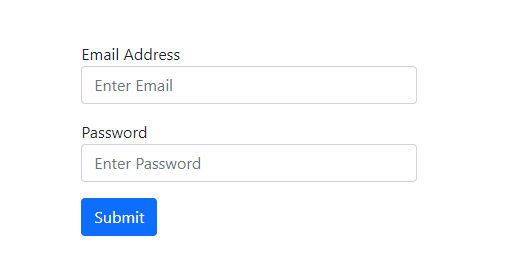

In React, we use refs to access and manipulate DOM nodes.

### Creating refs

In function components, we can create refs using the ~~useRef()~~ hook.

~~useRef()~~ creates a JavaScript object that has a ~~current~~ property.

### Accessing refs

After creating refs, we attach them to React elements that we want to get access to, using the ~~ref~~ attribute. Then we can access the underlying DOM node at the ref’s ~~current~~ property.

### Use cases

One of the good use cases of using refs is to manage focus.

Let’s say you have an application in which you have a ~~Login~~ component that renders a login form. Whenever the ~~Login~~ page loads, you want the email input box to be always in autofocus. We can achieve this using refs.

Below, we have a ~~Login~~ component, styled using Bootstrap classes.

```jsx:title=src/components/Login.js {numberLines}
import React from "react";

const Login = () => {

  return (
    <div className="col-md-4 mx-auto mt-5">
      <form>
        <div className="form-group mb-3">
          <label for="inputEmail">Email Address</label>
          <input
            type="email"
            id="inputEmail"
            className="form-control"
            placeholder="Enter Email"
          />
        </div>
        <div className="form-group mb-3">
          <label for="inputPassword">Password</label>
          <input
            type="password"
            id="inputPssword"
            className="form-control"
            placeholder="Enter Password"
          />
        </div>
        <button type="submit" className="btn btn-primary">
          Submit
        </button>
      </form>
    </div>
  );
};

export default Login;
```

The ~~Login~~ component when rendered looks like this:



Now, add the highlighted code snippets in the ~~Login.js~~ file.

```jsx:title=src/components/Login.js {numberLines, 1-1, 4-4, 6-8, 20-20}
import React, { useEffect, useRef } from "react";

const Login = () => {
  const inputEmailRef = useRef();

  useEffect(() => {
    inputEmailRef.current.focus();
  }, []);

  return (
    <div className="col-md-4 mx-auto mt-5">
      <form>
        <div className="form-group mb-3">
          <label for="inputEmail">Email Address</label>
          <input
            type="email"
            id="inputEmail"
            className="form-control"
            placeholder="Enter Email"
            ref={inputEmailRef}
          />
        </div>
        <div className="form-group mb-3">
          <label for="inputPassword">Password</label>
          <input
            type="password"
            id="inputPssword"
            className="form-control"
            placeholder="Enter Password"
          />
        </div>
        <button type="submit" className="btn btn-primary">
          Submit
        </button>
      </form>
    </div>
  );
};

export default Login;
```

Let’s understand the code snippets we have added.

**LINE 1**: We import the ~~useRef~~ hook from React.

**LINE 4**: We create a ref named ~~inputEmailRef~~ using the ~~useRef()~~ hook. We know that ~~useRef()~~ creates a JavaScript object that has a ~~current~~ property. We can check this by logging the value of ~~inputEmailRef~~ to the console.


**LINE 20**: We associate ~~inputEmailRef~~ to the email input element by passing it as the value of the ~~ref~~ attribute.

**LINE 8**: Inside ~~useEffect()~~, we use the ~~focus()~~ method to add focus to the email input box. Now, whenever the ~~Login~~ component mounts, React will assign the ~~current~~ property to the DOM element.

Now, whenever the ~~Login~~ page loads, the email input box will always be in autofocus.


