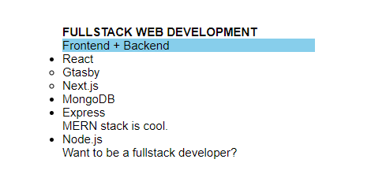

```toc

```

We will use the following HTML mark-up to illustrate the usage of three CSS selectors, known as combinators: child selector, adjacent sibling selector and general sibling selector.

```html:title=index.html {numberLines}
<!DOCTYPE html>
<html lang="en">
<head>
    <meta charset="UTF-8">
    <meta http-equiv="X-UA-Compatible" content="IE=edge">
    <meta name="viewport" content="width=device-width, initial-scale=1.0">
    <link rel="stylesheet" href="style.css"/>
    <title>Document</title>
</head>
<body>
    <div class="web-technology">
    <h2>FULLSTACK WEB DEVELOPMENT</h2>
    <p>Frontend + Backend</p>
    <ul class="tech">
        <li>React</li>
        <ul class="framework">
            <li>Gtasby</li>
            <li>Next.js</li>
        </ul>
        <li>MongoDB</li>
        <li>Express</li>
        <p>MERN stack is cool.</p>
        <li>Node.js</li>
    </ul>
    <p>Want to be a fullstack developer?</p>
</div>
</body>
</html>
```

```css:title=style.css {numberLines}
* {
  padding: 0;
  margin: 0;
  box-sizing: border-box;
}

html {
  font-family: sans-serif;
  font-size: 62.5%;
}

.web-technology {
  width: 40rem;
  padding: 4rem;
  margin: auto;
}

ul li,
p {
  font-size: 1.5rem;
}
```

The UI now looks like this:


### Child selector (>)

Selects all the elements that are direct children of the specified element.

```css {numberLines}
.tech > li {
  font-weight: 400;
  color: red;
}
```


### Adjacent sibling selector (+)

Selects all the elements that are immediately preceded by the element matched by the first selector.

Sibling elements must have the same parent element.

```css {numberLines}
h2 + p {
  background-color: skyblue;
}
```



### General sibling selector (~)

Selects the siblings of an element even if the siblings are not directly adjacent.

```css {numberLines}
h2 ~ p {
  font-weight: 600;
  color: orange;
}
```


