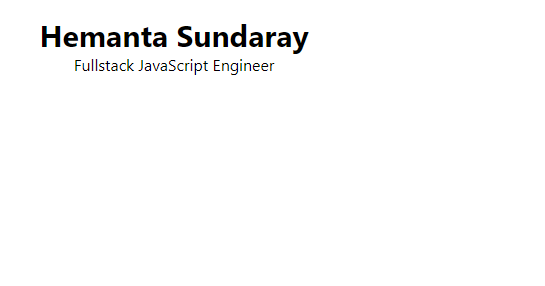
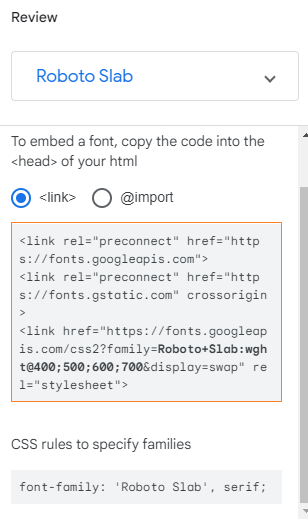
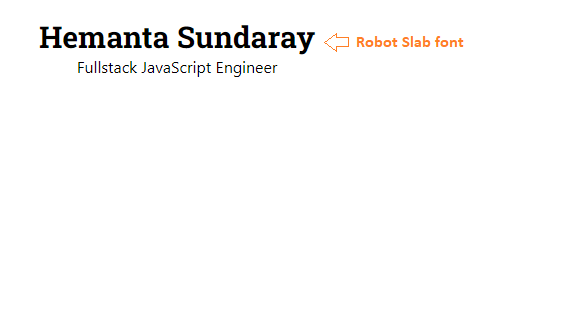

We have an UI component as shown below:



```jsx:title=src/App.js {numberLines}
import React from "react";

const App = () => {
  return (
    <div className="m-5 w-80 h-auto text-center">
      <h1 className="text-3xl font-bold">Hemanta Sundaray</h1>
      <h3 className="text-base">Fullstack JavaScript Engineer</h3>
    </div>
  );
};

export default App;
```

Let’s say we want to use a Google web font called Roboto Slab (a Serif font) for the ~~h1~~ element.

> By default, Tailwind provides three font family utilities: a cross-browser sans-serif stack, a cross-browser serif stack, and a cross-browser monospaced stack.

First of all, we need to go to [fonts.google.com](https://fonts.google.com/), search for Roboto Slab and select all the styles that we need for our app.

Next, we need to copy both of the ~~\<link />~~ tags and paste them into the ~~\<head>~~ of our HTML.



```html:title=public/index.html {numberLines, 16-16}
<!DOCTYPE html>
<html lang="en">
  <head>
    <meta charset="utf-8" />
    <link rel="icon" href="%PUBLIC_URL%/favicon.ico" />
    <meta name="viewport" content="width=device-width, initial-scale=1" />
    <meta name="theme-color" content="#000000" />
    <meta
      name="description"
      content="Web site created using create-react-app"
    />
    <link rel="apple-touch-icon" href="%PUBLIC_URL%/logo192.png" />
    <link rel="manifest" href="%PUBLIC_URL%/manifest.json" />
    <link rel="preconnect" href="https://fonts.googleapis.com">
    <link rel="preconnect" href="https://fonts.gstatic.com" crossorigin>
    <link href="https://fonts.googleapis.com/css2?family=Roboto+Slab:wght@400;500;600;700&display=swap" rel="stylesheet">
    <title>React App</title>
  </head>
  <body>
    <noscript>You need to enable JavaScript to run this app.</noscript>
    <div id="root"></div>
  </body>
</html>
```

Now, we are going to create a custom font-family utility class to create this Roboto Slab font.

In the ~~tailwind.config.js~~ file, we are going to extend the ~~fontFamily~~ object.

```js:title=tailwind.config.js {numberLines, 6-8}
module.exports = {
  purge: ["./src/**/*.{js,jsx,ts,tsx}", "./public/index.html"],
  darkMode: false, // or 'media' or 'class'
  theme: {
    extend: {
      fontFamily: {
        robotoslab: "'Roboto Slab', serif",
      },
    },
  },
  variants: {
    extend: {},
  },
  plugins: [],
};
```

Inside the ~~fontFamily~~ object, I have named the key to ~~robotoslab~~. You can name the key anything you want. **This will create a ~~font-robotoslab~~ utility class, which we can use on any element in our markup.**

Let’s apply this utility class on the ~~h1~~ element.

```jsx:title=src/App.js {numberLines, 6-6}
import React from "react";

const App = () => {
  return (
    <div className="m-5 w-80 h-auto text-center">
      <h1 className="text-3xl font-bold font-robotoslab">Hemanta Sundaray</h1>
      <h3 className="text-base">Fullstack JavaScript Engineer</h3>
    </div>
  );
};

export default App;
```

As we can see below, the font family for the ~~h1~~ element has been changed to Roboto Slab.


