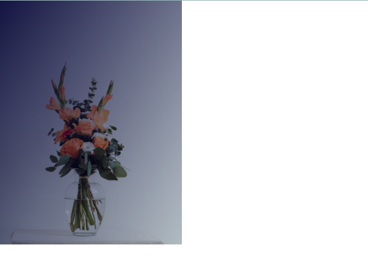

```html {numberLines, 11-11}
<!DOCTYPE html>
<html lang="en">
  <head>
    <meta charset="UTF-8" />
    <meta http-equiv="X-UA-Compatible" content="IE=edge" />
    <meta name="viewport" content="width=device-width, initial-scale=1.0" />
    <title>Document</title>
    <link rel="stylesheet" href="style.css" />
  </head>
  <body>
    <div class="gradient"></div>
  </body>
</html>
```

```css {numberLines, 12-20}
* {
  padding: 0;
  margin: 0;
  box-sizing: border-box;
}

html {
  font-size: 10px;
  font-family: sans-serif;
}

.gradient {
  width: 30rem;
  height: 40rem;
  background: linear-gradient(
      to bottom right,
      rgba(0, 0, 50, 0.9),
      rgba(0, 0, 0, 0.05)
    ), url("./images/vase.jpg") no-repeat center / cover;
}
```

**Result**


