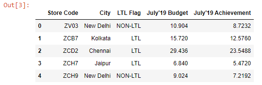

Let’s read the ~~budget.xlsx~~ file into a DataFrame:

```py {numberLines}
import pandas as pd

budget = pd.read_excel("budget.xlsx")

budget
```

**Output:**



Let’s check whether the city ~~Jaipur~~ exists in the ~~City~~ column using the ~~in~~ keyword.

```py {numberLines}
“Jaipur” in budget[“City”].values

True # Returns a boolean
```
