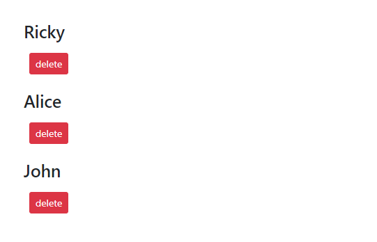

In React, we can manage application state using two hooks: ~~useState~~ & ~~useReducer~~.

> **Note**: The ~~useContext~~ hook is **NOT** a state management tool. It’s a mechanism to broadcast data to components that need them, avoiding the need to manually pass props down at every intermediate level of the component tree.

We use ~~useReducer~~ when we have complex state logic where the next state depends on the previous one.

### Syntax

```sh
const [state, dispatch] = useReducer(reducer, initialState);
```

The first argument to ~~useReducer~~ is a ~~reducer~~ function. The second argument is the initial state of the application. It returns the current ~~state~~ and a ~~dispatch~~ method.

If you have used Redux, then you must be familiar with the concepts of dispatching actions and reducer functions.

Here is the refresher:

- A reducer is a function that receives the current state and an action object, decides how to update the state and returns the new state - ~~(state, action) => new state~~. You can think of the reducer function as an event listener which handles events based on the action type.

- An action is an event that describes something that happened in our application.
  Clicking on the submit button of a login form, for example, is an example of an event. An action is represented as a plain JavaScript object This object contains two fields: a ~~type~~ field that represents the type of the event and a ~~payload~~ field that contains any additional information that we want to pass to the reducer function.

Now, let’s understand how ~~useReducer~~ works with the help of an example.

Below, we have a ~~Contacts~~ component that maps through an array of contacts and renders a list along with delete buttons next to each of the contact names.

```jsx:title=src/components/Contacts.js {numberLines}
import React from "react";

const initialState = [
  { id: 1, firstName: "Ricky" },
  { id: 2, firstName: "Alice" },
  { id: 3, firstName: "John" },
];

const Contacts = () => {
  return (
    <div className="col-md-4 m-5">
      {initialState.map(({ id, firstName }) => (
        <div className="mb-3" key={id}>
          <h3>{firstName}</h3>
          <button
            className="btn btn-sm btn-danger m-2"
          >
            delete
          </button>
        </div>
      ))}
    </div>
  );
};

export default Contacts;
```

The resulting UI looks like this:



The delete button does not do anything yet.

Next, add the highlighted code snippets.

```jsx:title=src/components/Contacts.js {numberLines, 1-1, 9-15, 18-18, 22-22, 27-27}
import React, { useReducer } from "react";

const initialState = [
  { id: 1, firstName: "Ricky" },
  { id: 2, firstName: "Alice" },
  { id: 3, firstName: "John" },
];

const reducer = (state, { type, payload }) => {
  if (type === "delete") {
    return state.filter((contact) => contact.id !== payload);
  } else {
    return state;
  }
};

const Contacts = () => {
  const [state, dispatch] = useReducer(reducer, initialState);

  return (
    <div className="col-md-4 m-5">
      {state.map(({ id, firstName }) => (
        <div className="mb-3" key={id}>
          <h3>{firstName}</h3>
          <button
            className="btn btn-sm btn-danger m-2"
            onClick={() => dispatch({ type: "delete", payload: id })}
          >
            delete
          </button>
        </div>
      ))}
    </div>
  );
};

export default Contacts;
```

Let’s understand the code snippets that we have added.

**LINE 1**: We import the ~~useReducer~~ hook.

**LINE 27**: Whenever we click on the ~~delete~~ button, we pass an action (a JavaScript object) as an argument to the ~~onClick~~ event listener. The value of the ~~type~~ field is ~~delete~~. You can name the action type anything you want; however it is always better to give it a descriptive name. To delete a specific contact, we want its ~~id~~, which we pass as the value of the ~~payload~~ field.

**LINE 9-15**: Then in the ~~reducer~~ function, we use JavaScript’s ~~filter~~ method (an array iterator method) to filter the contact that we want to delete from the initial state.

Now, click on any ~~delete~~ button next to any contact name and that specific contact gets deleted.

I have never used ~~useReducer~~ as a state management tool in any of the React apps that I have built so far. Redux Toolkit does the job for me. Let’s see if I ever get to use this hook.
