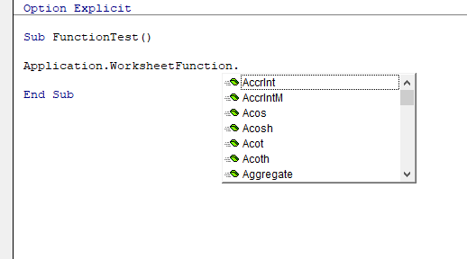
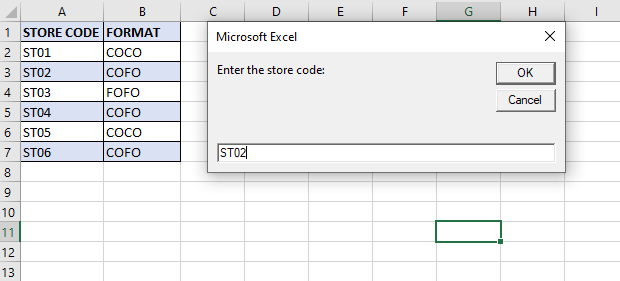
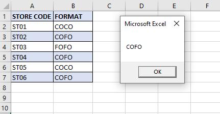

```toc

```

We can use most of Excel’s worksheet functions in our VBA procedures and extend their functionality.

We can see a list of functions we can use by typing ~~Application.WorksheetFunction~~ followed by a period.



The only worksheet functions that we can’t use are those that have an equivalent function. For example, we can’t use Excel’s ~~RAND~~ function (which generates a number) because VBA has an equivalent function: ~~Rnd~~.

VBA makes Excel’s worksheet functions available through the ~~WorksheetFunction~~ object, which is contained in the ~~Application~~ object. The following is an example of how we can use Excel’s ~~SUM~~ function in a VBA statement:

```vb {numberLines}
Total = Application.WorksheetFunction.SUM(Range(“A1:A10”))
```

We can omit either the ~~Application~~ part or the ~~WorksheetFunction~~ part of the expression. The following three expressions all work exactly the same:

```vb {numberLines}
Total = Application.WorksheetFunction.SUM(Range(“A1:A10”))

Total = Application.SUM(Range(“A1:A10”))

Total = WorksheetFunction.SUM(Range(“A1:A10”))
```

**Examples:**

### Finding the average value in a range

The following procedure displays the average value of the range A1:A7.

```vb {numberLines}
Sub FindAverage()

    Dim average As Long

    average = WorksheetFunction.average(Range("A1:A7"))

    MsgBox average

End Sub
```

### Using the VLOOKUP function

The following example uses VBA’ InputBox & MsgBox functions, plus Excel’s VLOOKUP function. It prompts for a store code and then gets the format from the lookup range A1:B7.

```vb {numberLines}
Sub FetchStoreFormat()

    Dim Format As String
    Dim storeCode As String

    storeCode = InputBox("Enter the store code:")

    Worksheets("data").Activate

    Format = Application.WorksheetFunction.VLookup(storeCode, Range("A1:B7"), 2, False)

    MsgBox Format

End Sub
```




