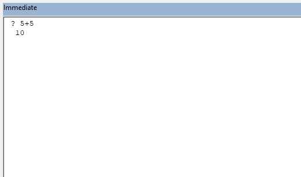
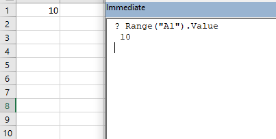

The shortcut for opening the immediate window is ~~ctrl + G~~.

We can test little snippets of code in the immediate window of the visual basic editor. You can think of it as a console of sorts.

For example, if we want to check the value of an expression, let’s say, ~~5 + 5~~, we first put a question mark (~~?~~) followed by the expression and then press enter.

Let’s consider another example. The value in cell A1 is 10. We can read this value in the immediate window, as shown below:

