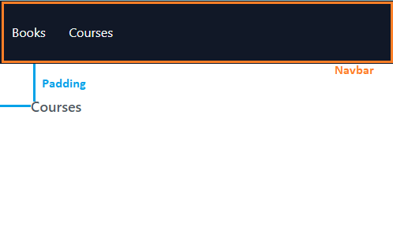

Lets consider an app that renders two pages: ~~Books~~ & ~~Courses~~. The ~~Books~~ page is rendered on the ~~/books~~ route & the ~~Courses~~ page is rendered on the ~~/courses~~ route.


Both the pages share a common UI - the navigation bar - and common styling - padding of ~~p-4~~.



The code for our app looks like the following:

```js:title=src/components/Books.js {numberLines}
import React from "react"

const Books = () => {
  return <h2 className="text-lg font-medium text-gray-600">Books</h2>
}

export default Books
```

```js:title=src/components/Courses.js {numberLines}
import React from "react";

const Courses = () => {
  return <h2 className="text-lg font-medium text-gray-600">Courses</h2>;
};

export default Courses;
```

```js:title=src/components/Navbar.js {numberLines}
import React from "react";
import { Link } from "react-router-dom";

const Navbar = () => {
  return (
    <nav className="w-full h-20 bg-gray-900">
      <ul className="w-40 h-20 p-4 flex justify-between items-center list-none">
        <Link to="/books">
          <li className="text-gray-50">Books</li>
        </Link>
        <Link to="/courses">
          <li className="text-gray-50">Courses</li>
        </Link>
      </ul>
    </nav>
  );
};

export default Navbar;
```

```js:title=src/App.js {numberLines}
import React from "react";
import { Routes, Route } from "react-router-dom";
import Navbar from "./components/Navbar";
import Books from "./components/Books";
import Courses from "./components/Courses";

const App = () => {
  return (
    <>
      <Navbar />
      <main className="p-10">
        <Routes>
          <Route path="/books" element={<Books />} />
          <Route path="/courses" element={<Courses />} />
        </Routes>
      </main>
    </>
  );
};

export default App;
```

In such scenarios, where multiple routes share common UI & styling, we can extract common UI & styling to a layout route.

A layout route is a parent route WITHOUT a ~~path~~ prop. It does not have a ~~path~~ prop because it is not used to render an element when the path pattern matches the current URL. **Instead, It is used exclusively to group child routes inside a specific layout.**

> A route with child routes is called a parent route.

Now that we understand the purpose of a layout route, let’s nest both the ~~/books~~ and ~~/courses~~ routes inside a layout route and extract the common UI & styling inside a new ~~\<Layout>~~ component.

```js:title=src/components/Layout.js {numberLines, 19-19}
import React from "react"
import { Link } from "react-router-dom"
import { Outlet } from "react-router-dom"

const Layout = () => {
  return (
    <>
      <nav className="w-full h-20 bg-gray-900">
        <ul className="w-40 h-20 p-4 flex justify-between items-center list-none">
          <Link to="/books">
            <li className="text-gray-50">Books</li>
          </Link>
          <Link to="/courses">
            <li className="text-gray-50">Courses</li>
          </Link>
        </ul>
      </nav>
      <main className="p-10">
        <Outlet />
      </main>
    </>
  )
}

export default Layout
```

> Note that an ~~\<Outlet>~~ is used inside a parent route to render the child routes.

```js:title=src/App.js {numberLines, 10-10, 13-13}
import React from "react";
import { Routes, Route } from "react-router-dom";
import Layout from "./components/Layout";
import Books from "./components/Books";
import Courses from "./components/Courses";

const App = () => {
  return (
    <Routes>
      <Route element={<Layout />}>
        <Route path="/books" element={<Books />} />
        <Route path="/courses" element={<Courses />} />
      </Route>
    </Routes>
  );
};

export default App;
```

In the refactored version of our code, the layout route renders the ~~\<Layout>~~ component, which holds the common UI (the navigation bar) and styling.
