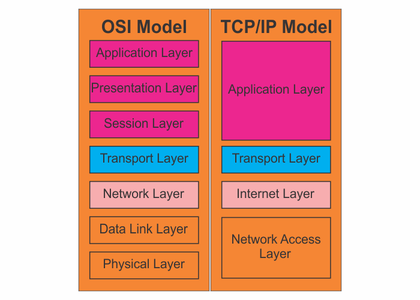

```toc

```



The OSI model isn't the only model that describes networking.

You will hear more often about the TCP/IP model, which is a 4-layered model that makes direct reference to current internet implementations. Its foundational protocols are TCP & IP.

The four layers of TCP/IP are as follows:

### Application Layer

This includes the opening and closing of sessions, translating data, and the interaction with content at the application level. Here, there are multiple protocols for web content, email, and accessing files, including HTTP, FTP, SMTP, and more.

### Transport Layer

TCP and UDP are the core protocols here. TCP is a connection oriented protocol, where a more rigorous acknowledgment between one sender and one receiver must happen before any data can be sent. This protocol also includes flow control and error recovery, and it is used when larger amounts of data need to be sent and timing is less of a concern.

UDP is a more lightweight protocol that does not require a fixed channel between a sender and receiver. It is often used when the amount of data sent is piecemeal and needs to be transmitted quickly.

### The Internet Layer

This is where IP addressing and routing occur.

### Network Access Layer

Sometimes called the Link layer, this layer encompasses the sending or receiving of network data at the local network level.
