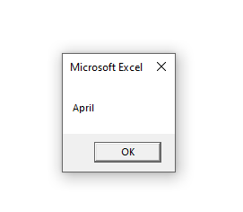

In VBA, we have a data type named ~~Date~~.

A variable defined as a ~~Date~~ can hold dates ranging from January 1, 0100, to December 31, 9999.

We place dates between two hash (~~#~~) marks.

**Example:**

```sh {numberLines}
Sub ShowMonth()

Dim Birthday As Date

Birthday = #4/26/1987#

MsgBox MonthName(Month(Birthday))

End Sub
```

**Output:**


