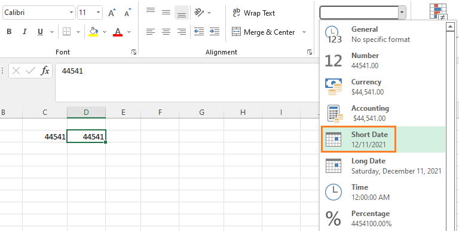

Sometimes while entering dates in Excel, you will see a number, for example 44541, rather than the date 12/11/2021.

What does this number mean and how can you change it to a normal date?

First off, you must understand that Excel can display a date in a variety of **month-day-year** formats, or it can display a date in **serial** format.

**A date in serial format, such as 44541, is simply a positive integer that represents the number of days between the given date and January 1, 1900 (both the current date and January 1, 1900 are included in the count)**.

Below, the value 44,541 in cell C2 indicates a date that is 44,541 days after January 1, 1900 (including both January 1, 1900 & the day 44,541).

To display this in a **month-day-year** format, copy the value in cell C2 to cell D2 and then simply format the cell as a Short Date.

Now we can see that the date in cell D2 is displayed in the **month-day-year** format.

