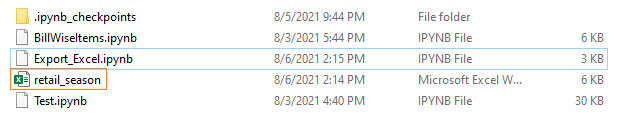
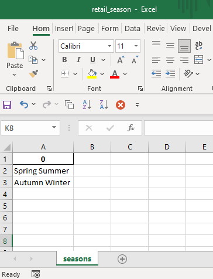
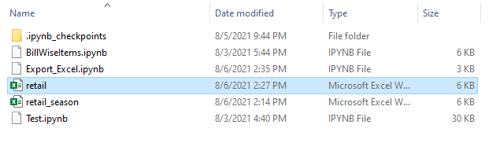
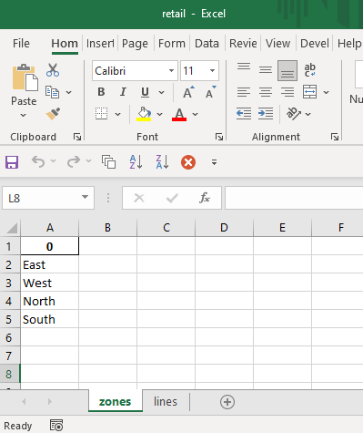

```toc

```

### Writing a single DataFrame

We can write a DataFrame to an Excel file using the ~~to_excel~~ method. We can pass a value to the ~~sheet_name~~ parameter to name the worksheet inside the workbook.

**Example:**

```py {numberLines}
import pandas as pd

seasons = pd.DataFrame(["Spring Summer", "Autumn Winter"])

seasons.to_excel("retail_season.xlsx", sheet_name="seasons", index=False)
```

Executing the code snippet above creates a file named ~~retail-season.xlsx~~.



Inside the ~~retail-season.xlsx~~ file, we have a worksheet named ~~seasons~~.



### Writing multiple DataFrames

We can write more than one DataFrame to a single Excel file (_each DataFrame object on a separate worksheet_) using the ~~ExcelWriter~~ object along with the ~~with~~ keyword.

In the code snippet below, we write two DataFrame objects (~~zones~~ & ~~lines~~) to two different worksheets(~~zones~~ & ~~lines~~) in one Excel file:

```py {numberLines}
import pandas as pd

zones = pd.DataFrame(["East", "West", "North", "South"])
lines = pd.DataFrame(["Menswear", "Womenswear", "Kidswear", "Accessories"])

with pd.ExcelWriter("retail.xlsx") as writer:
    zones.to_excel(writer, sheet_name="zones", index=False)
    lines.to_excel(writer, sheet_name="lines", index=False)
```

Executing the code snippet above creates a file named ~~retail.xlsx~~.



Inside ~~retail.xlsx~~, we have two worksheets: ~~zones~~ & ~~lines~~


